# Introduction

YourCompany is a Direct-to-Consumer (D2C) European sneaker manufacturer. YourCompany operates 3 manufacturing sites in Germany, Sweden and Estonia with multiple distribution centres, 10 retail brick and mortar stores and an e-commerce store. 
YourCompany makes sneakers for men, women and kids. For each gender type, YourCompany has 3 different categories: 
- GenZ Pros: These are sneakers designed for modern professionals that wants to pair sneakers with suits, trousers, office wear or any professional setting to make a lasting impression
- Altars: These sneakers can be for a coffee date, dinner with your parents, or for just taking your dog for a walk. These sneakers go with your mood in the moment when you want to step out but don’t want to decide what footwear to wear
- Colours: Who said sneakers had to be white or black and restricted to fixed colours. Find sneakers that match your vibe whether its vibrant, classic, ultra-modern, rainbow or a unicorn.

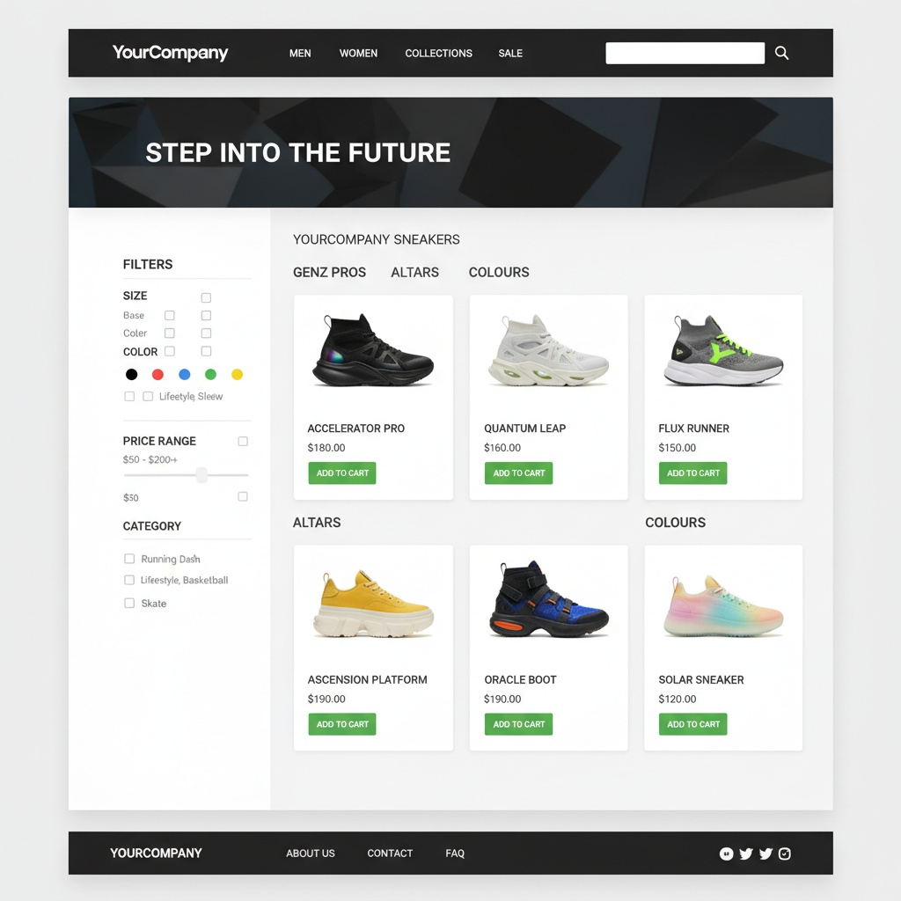

YourCompany partners with logistics companies to route the sneaker boxes from their distribution centres to customers’ addresses when the orders are placed online. YourCompany runs a design and simulation lab in which they design sneakers as per the latest style trends and test the sneakers for durability, duress and performance to ensure that every customer feels that each sneaker is of high quality and can be used for multiple purposes.

YourCompany also owns a factory producing rubber required for sneakers that is sensitive to temperature changes during production. You are producing these products day and night, all year long, and you want to analyze and control the production process in real-time. So, you are interested in both the performance of your machinery and the environmental conditions (like temperature and humidity) inside and outside your factory.

In this workshop, we will answer questions such as:
- How are my customers interacting with my e-commerce portal?
- What are my factory's performance parameters? How can I make it more efficient?
- What are the shipping delays when sending sneakers to my customers?

Collecting real-time data (as observations, immutable events, facts) will add value to every modern enterprise. In this example, we look at a sneaker maker, but the same goes for logging, security audits, stock markets, shopping experience, vehicle data, etc.

This workshop will walk you through the process of building an end-to-end [Real-Time Intelligence](https://blog.fabric.microsoft.com/en-us/blog/introducing-real-time-intelligence-in-microsoft-fabric) Solution in Microsoft Fabric, using the latest features like Azure IoT Operations integration, Digital Twins and Agents for YourCompany.

You will learn how to:

- Build a factory analytics solution using Microsoft Fabric Real-Time Intelligence based on real-time telemetry and weather data.
- Stream telemetry into Microsoft Fabric Eventhouse via Eventstream.
- Stream LoraWan sensor events into Microsoft Fabric Eventhouse via Eventstream.
- Stream real-time weather data into Microsoft Fabric Eventhouse via Eventstream.
- Send clickstream data to a kafka enabled endpoint of Eventstream
- Auto ingest new XML files coming from the shipping companies 
- Create real-time data transformations in Microsoft Fabric Eventhouse through the power of Kusto Query Language (KQL).
- Create real-time visualizations using Real-Time Dashboards.
- Build Activator actions as alerts on the streaming data.
- Add a Digital Twin Builder representation.
- Add a conversational Data Agent to talk to your data.


All the **code** in this tutorial can be found here:
[Fabric Real-Time Intelligence Workshop](https://github.com/microsoft/fabconrtiworkshop/)

## Modalities

- Total workshop duration is 5-6 hours.
- Each section is accompanied by a technical explanation of the Fabric Real-Time Intelligence component being used in the tutorial.
- Without the accompanying explanation, the tutorial can be completed in 1-2 hours.

<div class="important" data-title="Note">

> There are two versions of this lab. One version is dependent on a given Azure Eventhub that streams the Factory and LoraWan data, in the other one, you can use notebooks to create the data streams **TBD**.

</div>

## Authors

- [Sander van de Velde](https://github.com/sandervandevelde), Microsoft MVP on Azure IoT & Real-Time Intelligence, Principal Architect, SDG Group
- [Devang Shah](https://www.linkedin.com/in/shahdevang/), Principal Program Manager, Microsoft

## Contributing

- If you'd like to contribute to this lab, report a bug or issue, please feel free to submit a pull request to the [GitHub repo](https://github.com/microsoft/fabconrtiworkshop/) for us to review or [submit any issues](https://github.com/microsoft/fabconrtiworkshop/issues) you encounter.

---

## Lab 1: Tracking and monitoring shipments 

Monitoring shipments across multiple shipping partners is essential for YourCompany as it provides comprehensive visibility throughout the supply chain, minimizing the risk of delays or disruptions. It allows for the early detection of potential issues such as lost, delayed, or damaged packages, thereby safeguarding patient trust and satisfaction. Consistent tracking also enables performance benchmarking across carriers, ensuring cost efficiency and reliability. Moreover, real-time monitoring supports adherence to delivery SLAs and regulatory requirements, which are particularly critical in healthcare logistics. In addition, the data collected offers valuable insights to drive continuous improvement and informed decision-making in operations.

## Lab 2: Real-time view into customer interactions 

Clickstream monitoring is vital for YourCompany as it provides detailed insights into how users interact with digital platforms, enabling a deeper understanding of customer behavior and preferences. By tracking user journeys in real time, it becomes possible to identify pain points, optimize website performance, and improve the overall user experience. This monitoring also highlights trends that inform data-driven decisions in marketing, product design, and service delivery. Furthermore, it supports the detection of unusual activity, strengthening security and compliance. Ultimately, the business value lies in driving higher engagement, improving conversion rates, and ensuring that digital services meet both customer needs and regulatory standards.

## Lab 3: Connected Factory 

In today's data-driven world, understanding factory behavior is essential for optimizing the production process for better Overall Equipment Effectiveness (OEE). This lab focuses on a simplified connected factory scenario that demonstrates how telemetry can be captured and analyzed using key data entities.

First, energy meter data from an electromotor running in the factory is collected, transformed, and visualized by ingesting that energy meter data from the machine into an Azure IoT Operations solution running on the Edge of the factory network.

In the factory, several low-powered sensors are collecting environmental data like Temperature and Humidity. These values are sent to a third-party LoraWan cloud solution and turned into insights by passing them on to Microsoft Fabric.

<div class="important" data-title="Note">

> LoRa low-power, wide-area wireless technology is ideal for remote sensors and devices that need to communicate over long distances – sometimes several kilometers. LoRa itself defines only the physical and data link layers, allowing for proprietary or point-to-point networking. It's typically used for simple, infrequent, or event-based messaging due to its limited bandwidth and duty cycle restrictions. LoraWan is a network protocol that builds on top of LoRa to manage communication between devices and applications. Several LoraWan cloud providers, like the community-driven The Things Network, provide a platform for registering devices and exposing received messages to other cloud solutions like Microsoft Azure.

</div>

Next to the local environmental sensors, weather service information is collected for a specific location, available in Microsoft Fabric. This way, an even better understanding of the environment outside the factory is available, and a comparison with the sensors inside the factory can be made.

## Lab 4: Event-driven actions to load and transform historical data

There are scenarios where YourCompany may receive batch loads of historical transactions from shipping providers, typically delivered as CSV files, to support reconciliation and audit processes. Such files are often provided when there are system downtime incidents, delayed data transfers, or at agreed monthly or quarterly intervals for financial settlement. Processing these files is highly relevant, as it ensures that all shipments, costs, and delivery statuses align with internal records and customer commitments. This reconciliation helps identify discrepancies such as billing errors, unreported deliveries, or missing data, thereby avoiding financial leakage and strengthening vendor accountability. Additionally, maintaining an accurate historical record is essential for compliance, audit readiness, and for deriving insights that improve carrier performance, cost management, and overall supply chain integrity.

---

## Architecture

### Fabric Real-Time Intelligence Architecture

Real-Time Intelligence empowers organizations to ingest, process, analyze, and interact with their data using natural language. It enables seamless data transformation and automated action — all centralized through the Real-Time Hub, which provides easy access to and visualization of both internal and external streaming data, including first- and third-party sources:

- Azure IoT Hub, Azure Event Hub, Azure Event Grid MQTT Broker, Azure Blob Storage events
- Change Data Capture (CDC) data from multiple databases like Azure Data Explorer, Azure SQL Database, MySQL database, Azure Cosmos DB, PostgreSQL Database
- Confluent Cloud for Apache Kafka, Apache Kafka, Amazon MSK Kafka
- Amazon Kinesis Data Streams
- Google Cloud Pub/Sub
- Solace PubSub+
- Real-Time Weather data service
- Fabric Job events
- etc.

This Real-Time hub works in conjunction with Eventstreams for ingesting that data, Eventhouse as a database optimized for storing and querying huge amounts of real-time data, Real-Time Dashboards for visualizing, and the Activator for turning alerts into eg. emails or Teams messages.

### Lab Architecture

In this lab, we won’t cover every aspect of a Real-Time Intelligence solution, but we will focus on the most essential components. By the end, you'll be equipped to build a complete end-to-end solution that incorporates all the key building blocks. These components are highlighted in the following architectural diagram:

   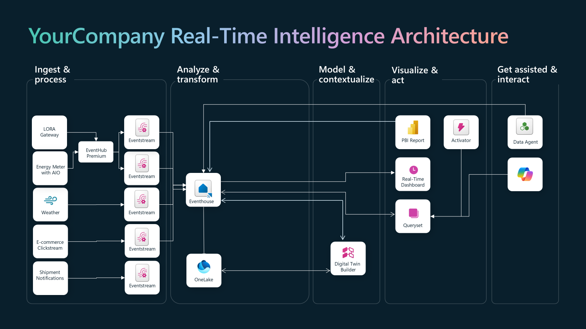

### Data schema

We work mainly with the Microsoft Fabric Eventhouse where data from three streams are stored in raw format, transformed via a medallion architecture, and queried using various tools like the KQL Queryset.

#### Tables and materialized views

These are the tables and materialized views you will encounter today.

##### Lab 1

| Name | Origin | Description |
| - | - | - |
| **RawShippingsMsgs** | Eventhouse table | Raw XML shipment notifications from the shipping companies |
| **ShippingNotifications** | Eventhouse table | Strongly typed tabl schema of raw XML shipping notifications|

##### Lab 2

| Name | Origin | Description |
| - | - | - |
| **RawClickstreamData** | Eventhouse table | Raw JSON clickstream data from the e-commerce website |
| **Clickstream_AddToCart** | Eventhouse table | Filtered data for Add To Cart event types|
| **Clickstream_BrowseCategory** | Eventhouse table | Filtered data for Browse Category event types |
| **Clickstream_CreateAccount** | Eventhouse table | Filtered data for Create Account event types |
| **Clickstream_Newsletter** | Eventhouse table | Filtered data for Newsletter event types |
| **Clickstream_ViewProduct** | Eventhouse Materialized view | Filtered data for View Product event types |

##### Lab 3

| Name | Origin | Description |
| - | - | - |
| **BronzeEnergyMeter** | Eventhouse table | Raw untyped energy meter data (current, voltage, reactive) |
| **SilverEnergyMeterCurrent** | Eventhouse table | Typed current data from energy meter |
| **SilverEnergyMeterVoltage** | Eventhouse table | Typed voltage data from energy meter |
| **BronzeLoraWan** | Eventhouse table | Raw untyped LoraWan data from many sensors |
| **SilverLoraWanTemperature** | Eventhouse table | Typed LoraWan environmental data from one type of temperature sensors |
| **GoldLoraWanTemperature** | Eventhouse Materialized view | Average LoraWan environmental data in 10-minute bins for a report |
| **BronzeWeather** | Eventhouse table | Real-time, raw, weather data from one or more locations, full of duplicates |
| **SilverWeather** | Eventhouse Materialized view | Real-time, typed, weather data from one or more locations, without duplicates |

Materialized views are used due to their unique ability to aggregate rows, like de-duplicating excess rows.

Via a medallion architecture implemented using Eventhouse table update policies and materialized views, the data is transformed after loading it into the database.

### Fabric Real-Time Intelligence Components

Let's cover the key features of Real-Time Intelligence in more detail and see how we plan to use them for our architecture.

#### Eventstreams

- Eventstreams allow us to bring real-time events (including Kafka endpoints) into Fabric, optionally transform them, and then route them to various destinations without writing any code (no-code).

- In this solution, for example, events from the electromotor energy meter, LoraWan sensors, and Real-Time weather data are ingested from multiple Eventstreams into the respective 'BronzeEnergyMeter', 'BronzeLoraWan', and 'BronzeWeather' tables.

- Enhanced capabilities allows us to source data into Eventstreams from Azure Event Hubs, IoT Hubs, Azure SQL Database (CDC), PostgreSQL Database (CDC), MySQL Database (CDC), Azure Cosmos Database (CDC), Google Cloud Pub/Sub, Amazon Kinesis Data Streams, Confluent Cloud Kafka, Azure Blog Storage events, Fabric Workspace Item events, Sample data or Custom endpoint (Custom App).

- Feature [documentation](https://learn.microsoft.com/fabric/real-time-analytics/event-streams/overview).

#### Eventhouse

- An Eventhouse can host multiple KQL Databases for easier management. It will store event data from the Eventstreams and automate transformations in real-time. Eventhouses are **specifically tailored** to time-based streaming, or batch events with structured, semi-structured, and unstructured data.

- In this solution, for example, raw events captured in the `BronzeEnergyMeter`, `BronzeLoraWan`, and `BronzeWeather` are forwarded to eg. `SilverEnergyMeterCurrent` data table, `SilverEnergyMeterVoltage` data table, `SilverLoraWanTemperature` data table, and a 'SilverWeather' materialized view. The Silver layer offers typed and de-duplicated data based on the raw data for easier querying. A `GoldLoraWanTemperature` materialized view is added too, providing 10-minute averages to demonstrate how reports can benefit from specialized 'gold' materialized views.

- An Eventhouse is the best place to store streaming data in Fabric. It provides a highly scalable analytics system with built-in Machine Learning capabilities for discrete analytics over highly granular data. It's useful for any scenario that includes event-based data, for example, telemetry and log data, time series and IoT data, security and compliance logs, or financial records.

- Eventhouses support Kusto Query Language (KQL) queries, T-SQL queries, and Python. The data is automatically made available in delta-parquet format and can be easily accessed from Notebooks for more advanced transformations.

- Feature [documentation](https://learn.microsoft.com/fabric/real-time-intelligence/eventhouse).

#### KQL Update policies

- This feature is also known as a mini-ELT (Extract, Load, Transform). Notice that the Load step comes before Transform, opposite to ETL. Update policies are automation mechanisms, triggered when new data is written to a table. They eliminate the need for external orchestration by automatically running a query to transform the ingested data and save the result to a destination table.

- Multiple Kusto 'table update policies' can be defined on a single table, allowing for different transformations and saving data to multiple tables simultaneously. **Target** tables can have a different schema, retention policy, and other policies than the **Source** table.

- In this solution, the data in derived silver layer tables (targets) of our medallion architecture is inserted upon ingestion into bronze tables (sources). Using Kusto's 'table update policy' feature, this appends transformed rows in real-time into the target table, as data is landing in a source table. This can also be set to run in as a transaction, meaning if the data from bronze fails to be transformed to silver, it will not be loaded to bronze either. By default, this is set to 'off', allowing maximum throughput.

- Eventhouse also offers setting a retention time for tables. Because raw data from bronze tables is duplicated into the silver tables, keeping the raw data is not a priority anymore. Setting a short retention time on the bronze table gives enough time to check for a correct execution of the 'table update policy' and offers efficient data usage.

- Feature [documentation](https://learn.microsoft.com/azure/data-explorer/kusto/management/update-policy).

#### KQL Materialized Views

- Materialized views expose an aggregation query over a source table, or over another materialized view. Materialized Views are common in the Silver and Gold layers of the medallion architecture. Most common materialized views provide the current reading of a metric or statistics of metrics over time. They can also be backfilled with historical data; however, by default, they are automatically populated by newly ingested data.

We will use a materialized view to create the weather data silver Layer in our medallion architecture, used for de-duplication of duplicate weather service data, and to create average temperatures per 10-minute bin for LoraWan temperature values in a Gold layer.

- Feature [documentation](https://learn.microsoft.com/azure/data-explorer/kusto/management/materialized-views/materialized-view-overview).

#### KQL Dynamic fields

- Dynamic fields are a powerful feature of KQL databases that support evolving schema changes and object polymorphism, allowing the storage/querying of different event types that have a common denominator of base fields.

- Feature [documentation](https://learn.microsoft.com/azure/data-explorer/kusto/query/scalar-data-types/dynamic).

#### Kusto Query Language (KQL)

- KQL is also known as the language of the Real-Time cloud. It's available in many other services such as Microsoft Sentinel, Azure Monitor, Azure Resource Graph, and Microsoft Defender. The code-name **Kusto** engine was invented by four engineers from the Power BI team over ten years ago and has been implemented across all Microsoft services, including GitHub Copilot, LinkedIn, Azure, Office 365, and XBOX.

- KQL queries are easy to write, read, and edit. The language is most commonly used to analyze logs, sign-on events, application traces, diagnostics, signals, metrics, and much more. Supports multi-statement queries, relational operators such as filters (where clauses), 'union', and 'join' to produce a tabular output. It allows the ability to simply pipe (|) additional commands for ad-hoc analytics without needing to re-write entire queries. It has similarities to PowerShell, Excel functions, LINQ, function SQL, and OS Shell (Bash). It supports DML statements, DDL statements (referred to as Control Commands), built-in machine learning operators for forecasting & anomaly detection, plus more... including in-line Python & R-Lang.

- In this solution, first, KQL commands will be automatically created and executed by Eventstream to ingest data when configuring the Eventhouse KQL Database destination. These commands will create the respective 'bronze' tables. Secondly, the control commands will be issued in a database script that automates creation of additional schema items such as Tables, Shortcuts, Functions, Policies, and Materialized-Views. Last but not least, KQL queries will be used to query the data in tables and materialized views to discover the data and visualize what is happening in the factory.

- Feature [documentation](https://learn.microsoft.com/azure/data-explorer/kusto/query/).

#### Copilot

- Copilot for Real-Time Intelligence is an advanced AI tool designed to help you explore your data and extract valuable insights. You can input questions about your data, which are then automatically translated into Kusto Query Language (KQL) queries. Copilot streamlines the process of analyzing data for both experienced KQL users and citizen data scientists.

- Feature [documentation](https://learn.microsoft.com/fabric/get-started/copilot-real-time-intelligence).

   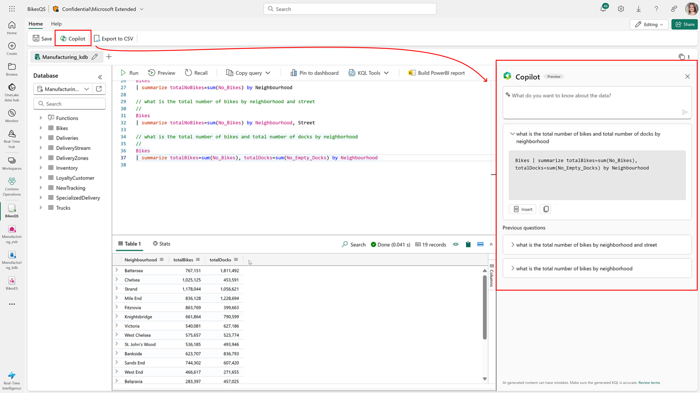

#### Real-Time Dashboards

   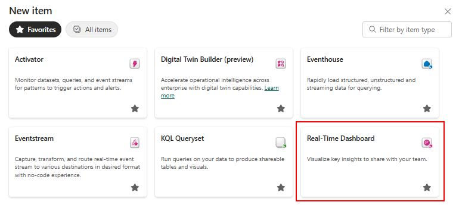

- While similar to Power BI's dashboard functionality, Real-time Dashboards have a different use case. Real-time Dashboards are commonly used for operational decision-making, rather than the business intelligence use cases Power BI targets. Power BI supports more advanced visualizations and provides richer data-story capabilities. Real-time Dashboards refresh very fast and allow with ease to toggle between visuals, and analysts to pro-developer can explore/edit queries without needing to download a desktop tool. This makes the experience simpler for analysts to understand and visualize large volumes of highly granular data.

- In this solution, the Real-time dashboard will be used to share important KQL queries with peers.

- This feature supports filter parameters, additional pages, markdown tiles, including Plotly, multiple KQL datasources, base queries, and embeddings. Real-time Dashboards also support sharing while retaining permission controls, setting of alerts via Activator, and automatic refresh with a minimum frequency as in 'immediately'.

- Feature [documentation](https://learn.microsoft.com/fabric/real-time-intelligence/dashboard-real-time-create).

#### Activator

- The Microsoft Fabric Activator offers a no-code experience in Microsoft Fabric for automatically taking actions when patterns or conditions are detected in changing data. It monitors data in eg. Power BI reports, Eventstreams items, and Real-time Dashboards, for when the data hits certain thresholds or matches other patterns. It then triggers the appropriate action, such as alerting users or kicking off Power Automate workflows.

- Some common use cases are:

  - Run Ads when same-store sales decline.
  - Alert store managers to move food from failing freezers before it spoils.
  - Retain customers who had a bad experience by tracking their journey through apps, websites etc.
  - Help logistics companies find lost shipments proactively by starting an investigation when the package status isn't updated for a certain length of time.
  - Alert account teams when customers fall behind with conditional thresholds.
  - Track data pipeline quality, to either re-run jobs, alert for detected failures, or anomalies.

- In this solution, we will set an alert in an Eventstream detecting high temperatures in the factory.

- Feature [documentation](https://learn.microsoft.com/fabric/data-activator/data-activator-introduction).

#### OneLake shortcut for Lakehouse

In Microsoft Fabric, a OneLake shortcut is a way to access data from other locations without physically moving or copying it. It acts like a virtual link, allowing you to work with data as if it were stored locally within your Lakehouse, even if it resides elsewhere. This means you can integrate data from various sources into your Lakehouse without creating duplicates. 

#### Digital Twin Builder

Fabric Digital Twin Builder is a low-code/no-code tool within Microsoft Fabric’s Real-Time Intelligence suite. It enables organizations to create digital twins—virtual representations of physical assets, processes, or environments—to optimize operations using data.

It's key capabilities are ontology modeling (Define a shared vocabulary and structure to represent real-world systems), data mapping (Connect diverse data sources to the ontology, harmonizing IT and OT data), semantic relationships (Model dependencies and interactions between entities), and visualization & insights (Integrate with Power BI and Real-Time Dashboards for analytics and decision-making).

#### Data Agent

Data agent in Microsoft Fabric is a new Microsoft Fabric feature that allows you to build your own conversational Q&A systems using generative AI. A Fabric data agent makes data insights more accessible and actionable for everyone in your organization. With a Fabric data agent, your team can have conversations, with plain English-language questions, about the data that your organization stored in Fabric OneLake and then receive relevant answers. This way, even people without technical expertise in AI or a deep understanding of the data structure can receive precise and context-rich answers.

You can also add organization-specific instructions, examples, and guidance to fine-tune the Fabric data agent. This ensures that responses align with your organization's needs and goals, allowing everyone to engage with data more effectively. Fabric data agent fosters a culture of data-driven decision-making because it lowers barriers to insight accessibility, it facilitates collaboration, and it helps your organization extract more value from its data.


## Pre-requisites

To complete the lab, you **must** have access to a [Microsoft Fabric](https://www.microsoft.com/microsoft-fabric/getting-started) workspace with at least Contributor permissions.

- Recommended material to review (at least one) prior to this lab, however, it's not required:
  - [Write your first query with Kusto](https://aka.ms/learn.kql)
  - [Implement a Real-Time Intelligence Solution Tutorial](https://learn.microsoft.com/fabric/real-time-intelligence/tutorial-introduction)

### Fabric tenant and capacity for Instructor led trainings

<div class="important" data-title="Note">

> For the purpose of this tutorial, speakers/proctors will provide a tenant with capacity for you to build your solution.

</div>

<!-->
### Trial Tenant for the Lab

If you need a new Trial Tenant to complete the lab, we suggest registering a new Outlook.com email and follow these steps:

1. [Provision Fabric Trial Tenant](https://github.com/microsoft/FabricRTIWorkshop/tree/main/trialtenant) - see document and PowerShell script to set up a lab admin.

   - 25 workspaces with access to 25 logins will be created automatically (one workspace per user).
   - Participants should create items in the workspace designated for their own login.
   - If more than 25 accounts are necessary, additional Trial Tenants can be provisioned by repeating this process. Also, participants can share the lab credentials and use folders in their workspaces.

2. [Office 365 E5 Trial](https://blog.fabric.microsoft.com/blog/accessing-microsoft-fabric-for-developers-startups-and-enterprises). ⚠️ Make sure to disable recurring billing; otherwise your credit card will be charged for Office E5.

3. The "LabAdmin" credential should be used by the lab proctor.

4. The "LabAdmin" can have the pre-built lab items for Lab Users 01-24 to reference as a cheat sheet. To do so, grant Users 01-24 viewer permission to the "LabAdmin" workspace.

   

--->
---

## Building the platform - Azure Eventhub

<div class="info" data-title="Note">

> Use this section if you're participating in the guided lab with an environment provided by the lab instructors. If you're doing lab independently in your own environment, skip this section and proceed to Section DTB.

</div>

### 1. Log in to the Lab Environment

<div class="info" data-title="Note">

> Do **not** use an InPrivate browser window. We recommend using a Personal browser window to successfully run this lab.

</div>

1. **Open** [app.fabric.microsoft.com](https://app.fabric.microsoft.com/) in your browser.

   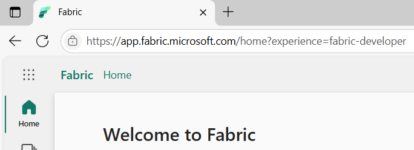

2. **Log in** with the provided credentials, if a trial fabric tenant was previously set up (reference Prerequisites). You may also choose to run the lab in your own Fabric Tenant if you already have one.

### 2. Fabric Workspace
<!---
1. If a Microsoft Fabric Workspace is 'designated' to your login by the Fabric Trial Tenant, **click** `Workspaces` in the menu on the left of the portal and open your designated workspace.

2. Optionally, if using your own Fabric Tenant, **create a new workspace** for this lab.

3. To create a new Workspace, **click** on `Workspaces` in the left pane and then **click** on `+ New Workspace` in the pop-up window.

   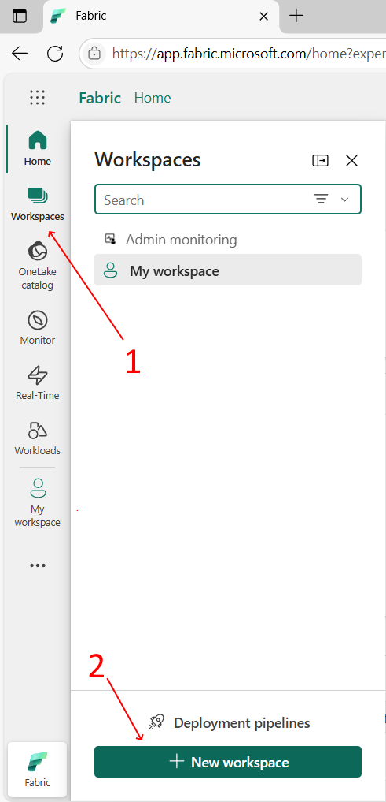

4. **Enter** `RTI Workshop` as the name for the new Workspace. Then **extend** `Advanced`.

   

<div class="info" data-title="Note">

> If the name that you would like to use for your workspace is still available, this will be shown below the input box for 'Name'. Workspace names have to be unique in a Fabric tenant.
</div>

5. **Check** if the option `Trial` is checked. If so, **click** on `Apply`.

   

6. After you click on `Apply`, the workspace will be created. This can take up to a minute. The workspace will be opened automatically.

We now have a working workspace to host our Real-Time Intelligence solution.
--->

For this workshop, Fabric items relevant for this workshop have been pre-created for you. Your workspace should look as shown in the image.


### 3. Lab 01 - Shipping Events

Our company receives Shipping events as batches in an Azure storage account, from a third party supplier.

We start with ingesting these shipping events into our already existing Fabric Eventhouse. 

There is no need for eg. a Data Factory. We can ingest directly using the Eventhouse.

1. In your workspace, **navigate** to the existing `EH_YCSneakerEventStore` Eventhouse.

   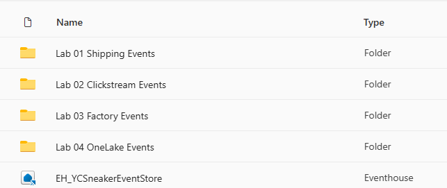

2. In the eventhouse main page, **click** on KQL Database of the same name `EH_YCSneakerEventStore`.

   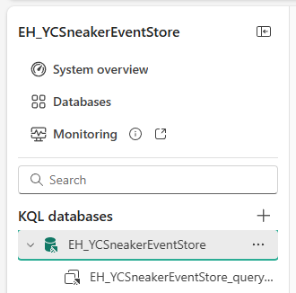

3. **Click** `Get Data` (via the three dots) and **choose** `Azure Storage` as the data source for ingesting data.

   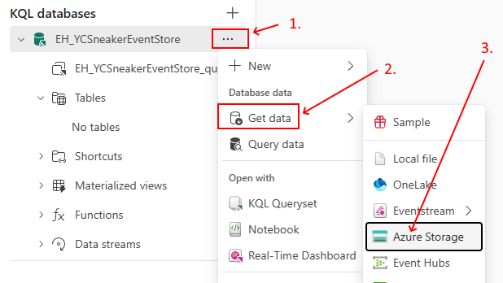

5. A dialog is shown. **Create** a new table `RawShippingMsgs`. Pay attention to this table name, it is reused later on (Copy the table name as-is else the subsequent scripts will fail to execute).

   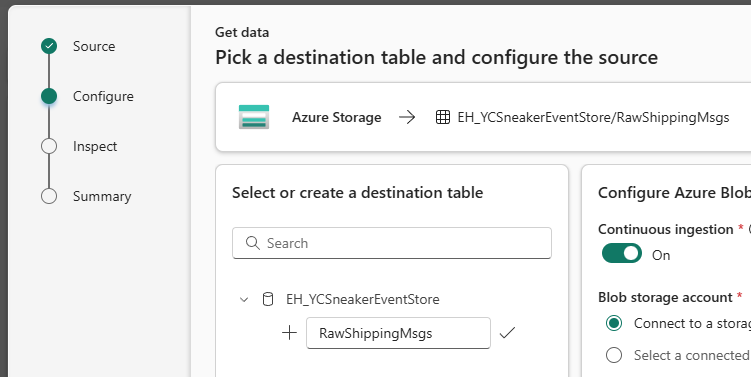

6. **Click** on the `tick mark` next to the table name to save the table name.

   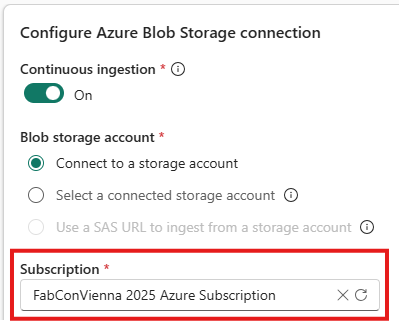

7. **Choose** `Connect to a storage account` if not selected already.

8. **Choose** `FabConVienna 2025 Azure Subscription` from the Subscription drop down.

9. **Choose** `fabconvienna2025sa` as the Blob storage account.

10. **Choose** `rawshippingmsgs` as the container.

   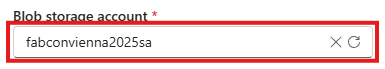

11. **Rename** the Eventstream Name to `ES_ShippingEvents`.

   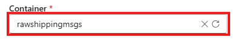

12. **Click** `Next`.

13. **Notice** the `preview of a single XML message` retrieved from the storage account.

   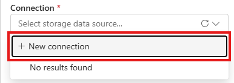

14. **Click** `Finish`.

15. After clicking 'Finish', the Eventhouse will establish a connection with the storage account and will read XML files as soon as they are created in the storage account, continuously! Let the processing continue as it completes the required background processes. You can click 'Close' and it will still continue the background processing. In the KQL Database tree, **notice** the `existence of table` 'RawShippingMsgs'.

   

16. **Click** on the table to see the `preview of the messages` ingested already.

17. **Navigate** back to your workspace and **go to** the `Lab 01 Shipping Events` folder.

18. **Open** KQL Query set `QS_YCShippingDDLScript`.

   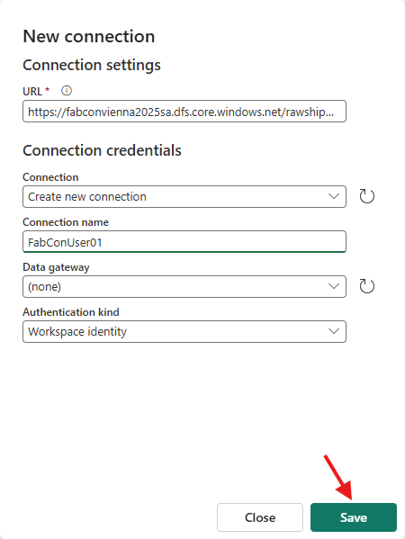

19. **Select** the `entire script` by putting the cursor in one of the lines (the entire script background color changes) and **click** `Run`. 

20. **Check** the `output as shown` in the image below. A new function, table and an update policy must have been created in your workspace.

   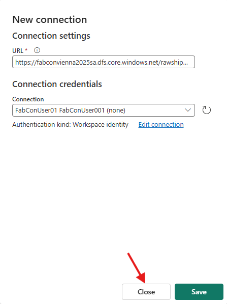

21. **Check** the new table `ShippingEvents` where processed,typed versions of the raw shipping events arrive.

   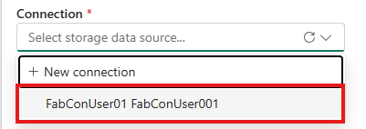

At this moment, the Eventhouse ingests files from a storage account in a 'bronze' medallion architecture and automatically the 'silver' layer is filled to using additional Table Update Policy logic.

### 4. Lab 02 - Clickstream Events

Let's ingest energy meter events with power consumption telemetry measured on the Edge. coming from the electromotor available in our demo factory.

### 4. Lab 03.1 - Create a new Energy Meter Telemetry Eventstream

In this section, we will be streaming Energy meter telemetry events (eg. current and voltage events from an electric motor). The events will be streamed into an Eventstream and be written into our Eventhouse KQL Database.

The events are coming from an Azure IoT Operations solution, running in some factory. Azure IoT Operations is the newest Edge solution, part of the Azure IoT solution, and offers running compute logic, with high-availability and failover, on the edge of your local network with a secure connection to the cloud.

An energy meter records the periodic power consumption of an electric motor and passes the values via an Industrial PLC (Programmable Logic Controller) to an IPC (Industrial PC) running Azure IoT Operations.

Via Azure Arc, an Azure IoT Operations dataflow, running on the edge, forwards the telemetry to the Azure Cloud.

You will ingest the energy meter data from an Azure Event Hub.

Notice that the electric motor starts and stops every 15 minutes so you will see some erratic behavior in the current consumption.

   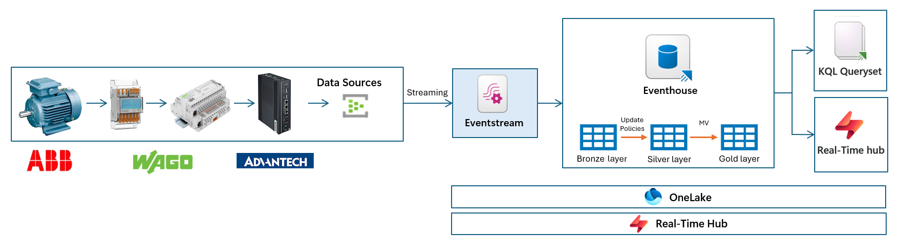

1. **Open** the Eventstream named `ES_EnergyMeter`, already provided in the 'Factory events folder'. On the Screen 'Design a flow to ingest, transform, and route streaming events' **click** on `Connect data sources`.

   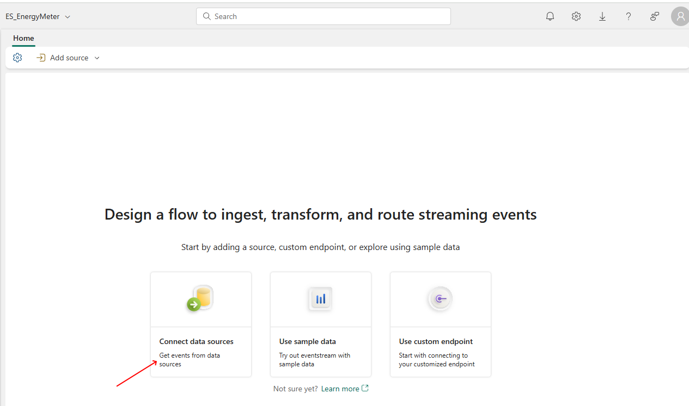

2. **Click** `Select a data source`. In the dialog **click** on the button `Connect`.

   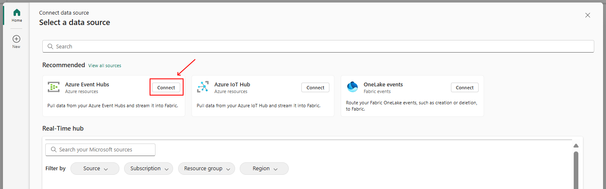

3. In the dialog 'Configure connection settings', **choose** `factorytelemetryeventhub` for the combobox 'Connection' and **insert** the name of the consumer group into the field 'Consumer group' that aligns with the username that was provided to you. In this case, this is `workshopuser49`. **Ensure** that the 'Data format' is `Json` and **click on the pencil** icon next to `Source name`.

   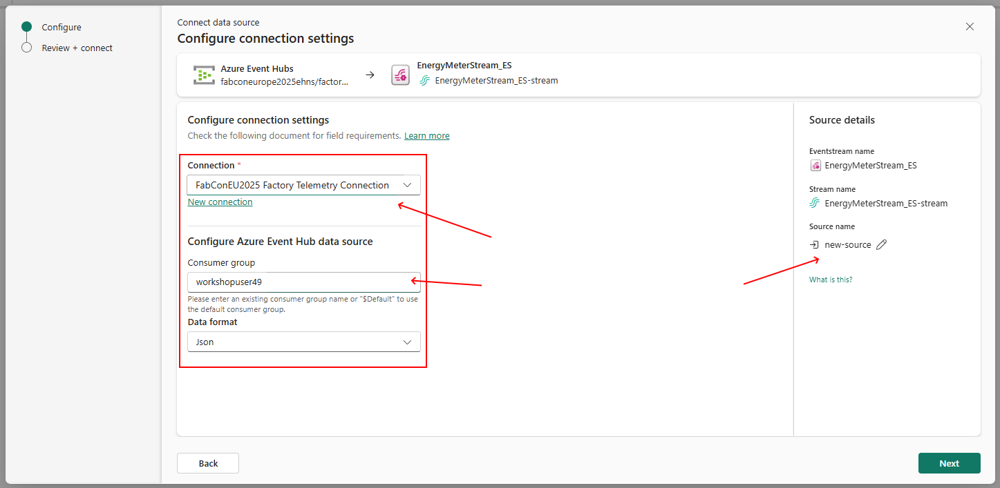

4. **Enter** `EnergyMeterEventsSource` as 'Source name' and then **click** on the button `Next`.

   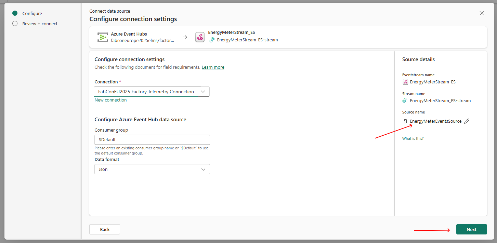

5. On the screen 'Review + Connect' **review** all of the information and then **click** on the button `Add`.

   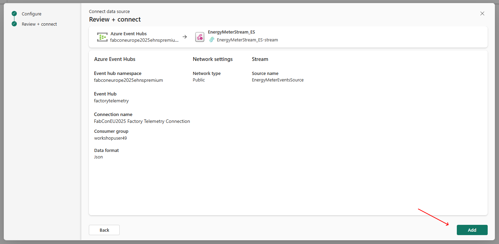

6. The source is added. **Notice** that data from several types of energy meter messages is received. We see the arrival of both 'current', 'voltage' and 'reactive' messages in the Test result. The related telemetry arrives every few seconds, with little pauses between them. Notice that the local time is provided in UTC.

   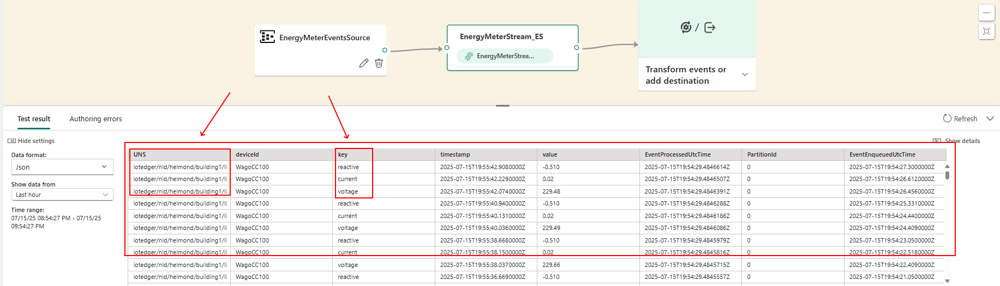

7. Eventstream offers multiple ways to transform incoming data, including a filter, perfect for making the Eventstream ignore the 'reactive' data. **Add a filter** by using the `drop-down option` in the 'Transform events or add destination' step (for now, ignore the 'Transform events' menu item).

   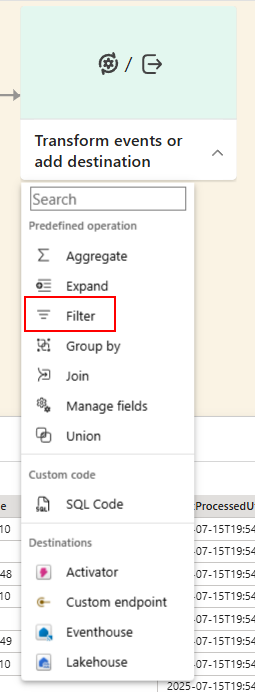

8. The step now turns into a Filter aggregation, but we need to set it up first. **Use the pencil** to set up the filter settings.

   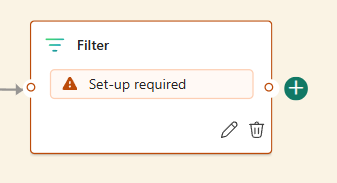

9. **Give the filter** a 'Operation name' like `ReactiveFilter`. We only want to keep messages when the `key does not equal reactive` by **selecting the 'key' column and adding the filter values**. **Save** the filter.

   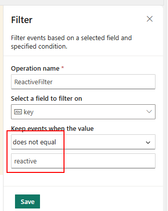

10. Although the filter is now set, it still shows 'error' because no Destination is set as next step.

   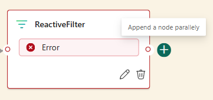

11. **Click on the plus sign** to the right of this Filter step and **select the Stream** (also known as Derived Stream). 

   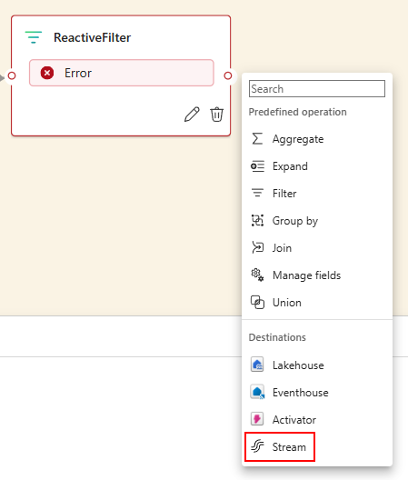

12. Notice that the 'error' message disappears when a Destination is added. **Use the pencil** to edit the Derived stream.

   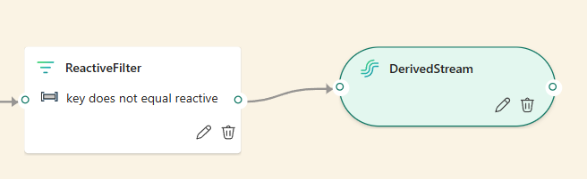

13. **Provide a Stream name** like `EnergyMeterDerivedStream`. **Save** the change.

   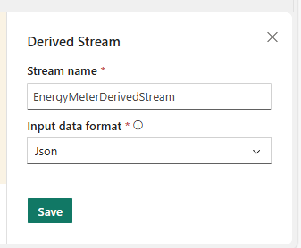

14. When you **select** the Derived stream and **Refresh** the test result, it shows only the 'current' and 'voltage' messages. The 'reactive' messages are now filtered.

   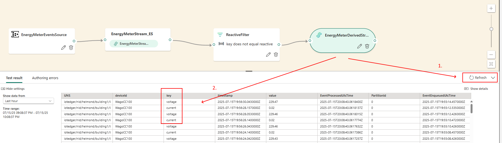

15. The Derived stream is added, so these messages are potentially shared with other users accessing the same workspace you are working on. Notice that the Derived stream can have other steps added to the right, it is not the end of the flow. **Add a destination** for an Eventhouse, behind the Derived stream.

   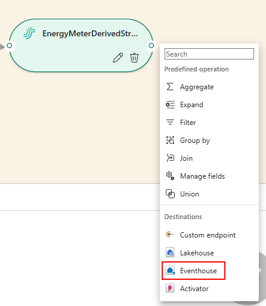

16. The Eventhouse destination needs a setup. **Click on the pencil** to set it up.

   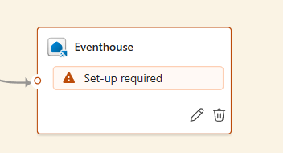

17. We **keep** the `Event processing before ingestion`. **Give the Destination a name** like `Eventhouse`. **Select your own workspace** and **Select your own Eventhouse** and **Select your own KQL Database**. Regarding the table, **Create a new table** and name it `BronzeEnergyMeter`. Keep the input data format to Json.

   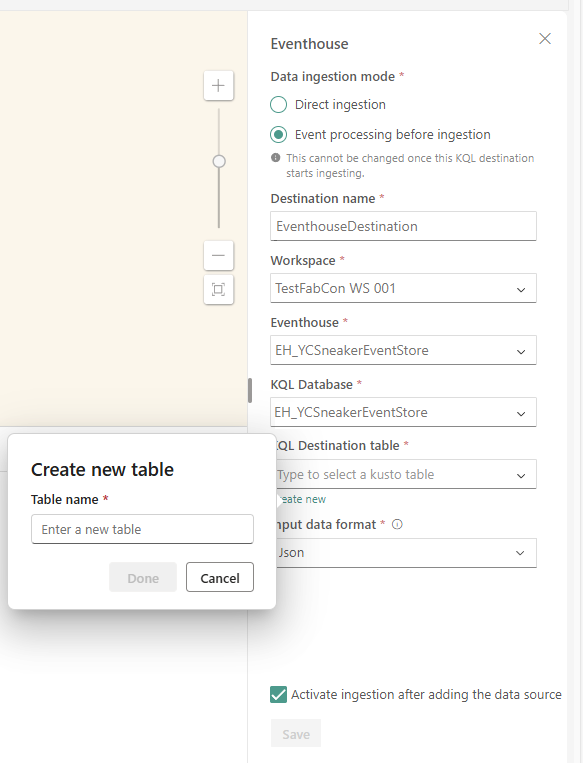

18. **Save** the Eventhouse Destination set-up.

   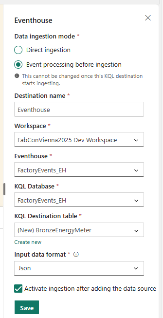

19. Once the destination dialog is saved, notice the Eventhouse destination will also receive only 'current' and 'voltage' messages by **Refreshing** the test result so Fabric knows what the format of the incoming messages looks like.

   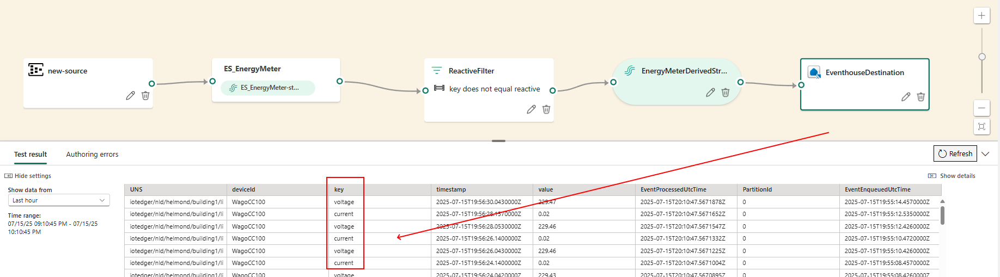

20. **Publish** the Eventstream.

   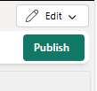

21. In the background, the table is created in the KQL Database of the Eventhouse, and the infrastructure is set up. This will take a moment or so.

   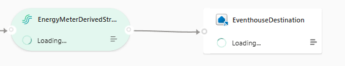

22. Finally, the Eventhouse destination is active.

   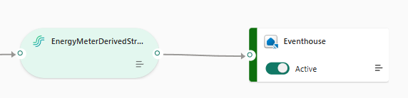

23. **Leave the Eventstream and navigate to** the `FactoryEvents_EH` Eventhouse and clicking on the `FactoryEvents_EH` KQL Database name. This will show all content in the KQL Database. Notice that the `BronzeEnergyMeter` table is added, now. Check the columns of that table, including the Universal Namespace (UNS) of the Compact Controller PLC.

   

24. If you **select** the table `Data preview`, a preview of the current ingested data is shown.

   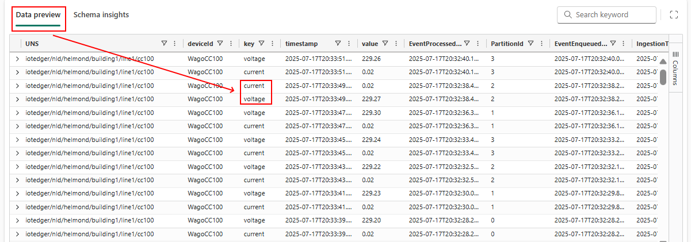

25. If you **select** the table `Schema insights`, a preview of the schema and some statistics are shown. Here, we see that multiple columns are of type 'string', including the 'value' column. Because this column represents decimal values in a string format, doing mathematical calculations will be hard. So, we need to fix that.

   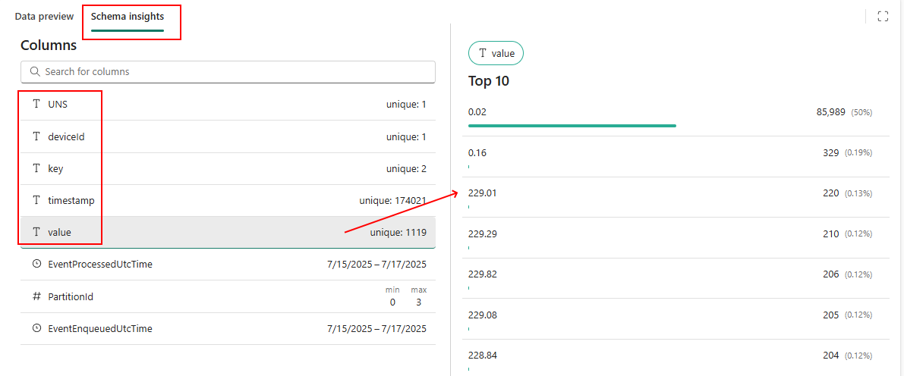

26. If you follow the three dots next to the `BronzeEnergyMeter` table name, you get a sub-menu with extra options. **Select Visual exploration** for a no-code experience.

   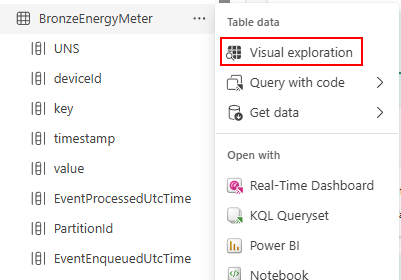

27. A new dialog is shown with a preview of incoming messages. Some visual statistics are shown to the right, like the distribution of keys. **Change the visualization** at the top.

   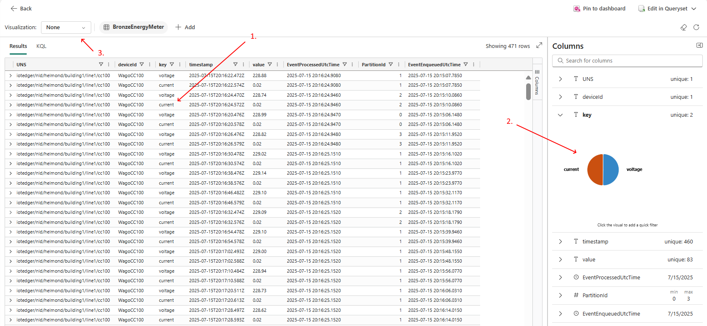

28. We want to see the same messages now visualized as a `Line chart`.

   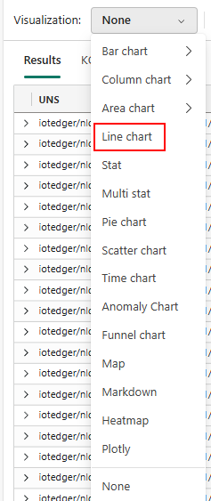

29. The visualization is not smart enough to understand the actual meaning of the value column at this moment. This is both because we are mixing two types of messages (`current` and `voltage`) and because the values are of type 'string', not decimal values. We will fix this later on.

   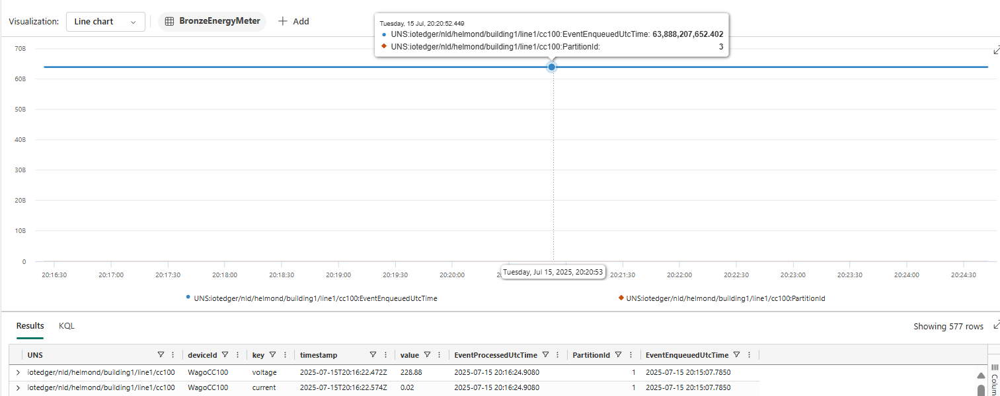

30. The visual exploration also offers extra filters and aggregations.

   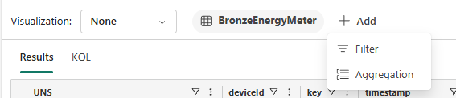

31. Just as a demonstration of how this dialog works, add an aggregation (Notice that this step will not produce any useful results due to the string values!). So, we are interested in the `Average operator` based on the `value column`. We **add two** `group by` rows. We **group by key** (so we potentially split 'current' messages from 'voltage' messages), and we **group by deviceId** so we split up messages coming from different devices. **Apply** the aggregation.
 
   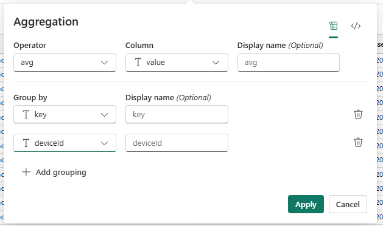

32. Because of the current limitation of the incoming data (the `value column` is still of type 'string'), so the aggregation will fail. But the intent of this dialog is still understood, the KQL query language shows a summary by key and deviceId.

   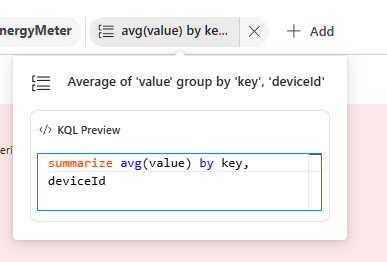

33. We will use the KQL query language to turn the bronze table into two separate silver tables. **Navigate to the KQL Queryset** named `FactoryEvents_EH_queryset`.

   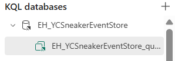

34. Each KQL Database comes with a KQL Queryset already. **See** the KQL Queryset of the 'FactoryEvents_EH' KQL Database in the 'FactoryEvents_EH' Eventhouse has opened. A KQL Queryset offers a sandbox for querying the data using the Kusto Query Language (KQL). We will also create extra logic using KQL commands. We will create a silver voltage table `SilverEnergyMeterVoltage` and fill it with typed voltage rows by creating a Table update policy based on the `BronzeEnergyMeter`. The typed silver table data is copied from the bronze table every time new bronze table rows arrive. The conversion part is done via the function `ParseVoltageTelemetry`. **Execute these three KQL commands separately**. Do this by placing them all in the KQL Queryset, putting the cursor in each command, and running it. Do this for **one after another**.

```
// query 1/3 - Create a table
.create table SilverEnergyMeterVoltage (voltageValue : double, timestamp : datetime, deviceId : string, company: string , country:string, city:string, building: string, line: string, unit: string) 

// query 2/3 - Create function
.create function
with (docstring = 'Ingest bronze energy meter data and project to silver voltage table', folder='ingestprojection')
ParseVoltageTelemetry ()
{
  BronzeEnergyMeter
    | where key has "voltage"
    | extend splitUNS=split(UNS, '/')
    | project 
        voltageValue = todouble(value),
        timestamp = todatetime(timestamp),
        deviceId = deviceId,
        company = tostring(splitUNS[0]),
        country = tostring(splitUNS[1]),
        city = tostring(splitUNS[2]),
        building = tostring(splitUNS[3]),
        line = tostring(splitUNS[4]),
        unit = tostring(splitUNS[5])
}

// query 3/3 - Add the table update policy
.alter table
SilverEnergyMeterVoltage 
policy update @'[{"Source": "BronzeEnergyMeter", "Query": "ParseVoltageTelemetry", "IsEnabled" : true, "IsTransactional": true }]'
```

35. If no errors are shown, test the Table update policy. **Execute this query** (Notice that it can take a moment before the update policy is up and running and new rows start to occure in the 'SilverEnergyMeterVoltage' table).

```
SilverEnergyMeterVoltage
| take 10
```

36. The result will **show** a list of ten random rows from the `SilverEnergyMeterVoltage` table via the 'take' statement.

   

37. **Repeat** this also for the other new silver table `SilverEnergyMeterCurrent`. Again, **execute these three KQL commands separately**, again one after another.

```
// query 1/3 - Create a table
.create table SilverEnergyMeterCurrent (currentValue : double, timestamp : datetime, deviceId : string, company: string , country:string, city:string, building: string, line: string, unit: string) 

// query 2/3 - Create function
.create function
with (docstring = 'Ingest bronze energy meter data and project to silver current table', folder='ingestprojection')
ParseCurrentTelemetry ()
{
  BronzeEnergyMeter
    | where key has "current"
    | extend splitUNS=split(UNS, '/')
    | project 
        currentValue = todouble(value),
        timestamp = todatetime(timestamp),
        deviceId = deviceId,
        company = tostring(splitUNS[0]),
        country = tostring(splitUNS[1]),
        city = tostring(splitUNS[2]),
        building = tostring(splitUNS[3]),
        line = tostring(splitUNS[4]),
        unit = tostring(splitUNS[5])
}

// query 3/3 - Add the table update policy
.alter table
SilverEnergyMeterCurrent 
policy update @'[{"Source": "BronzeEnergyMeter", "Query": "ParseCurrentTelemetry", "IsEnabled" : true, "IsTransactional": true }]'
```

38. If no errors are shown, test the Table update policy. **Execute this query** (Notice that it can take a moment before the update policy is up and running and table rows arrive in the 'SilverEnergyMeterCurrent' table).

```
SilverEnergyMeterCurrent
| take 10
```

39. The result will show a list of ten random rows from the `SilverEnergyMeterCurrent` table via the 'take' statement.

   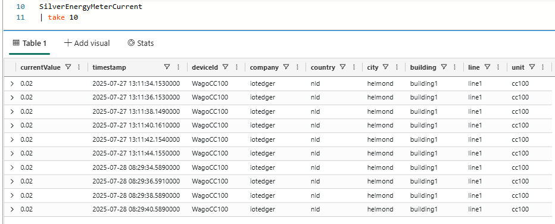

40. Now, we have typed columns in both tables, we can do some calculations. Did you notice we split the Universal Namespace (UNS) column and turned the values into doubles? **Execute the following query**. It will join the tables with typed voltage values and typed current values based on a time difference of less than a few seconds (because the telemetry arrives every few seconds). So the right combination is used to calculate the wattage used by the electromotor (when running). We only look at the latest ten entries.

```
SilverEnergyMeterCurrent
| top 10 by timestamp desc
| join kind=inner
    (
    SilverEnergyMeterVoltage
    ) on $left.deviceId == $right.deviceId
| where (timestamp - timestamp1) between (-0.7s .. 0.7s)
| extend wattage= round(voltageValue * currentValue, 2)
| project-reorder wattage, voltageValue, currentValue, deviceId, timestamp, timestamp1, company, country, city, building, line, unit
| project-away building1, city1, company1, country1, deviceId1, line1, unit1
| order by timestamp desc
```

41. The result will be a table with a `wattage` calculated from the current and voltage.

   

42. How about rendering the values? **Execute this query** with a 'render' statement.

```
SilverEnergyMeterCurrent
| top 60 by timestamp desc
| join kind=inner
    (
    SilverEnergyMeterVoltage
    ) on $left.deviceId == $right.deviceId
| where (timestamp - timestamp1) between (-0.7s .. 0.7s)
| extend wattage= round(voltageValue * currentValue, 2)
| project wattage, voltageValue, currentValue, timestamp, deviceId
| order by timestamp asc
| render timechart 
```

43. The result will be a chart with a `wattage` calculated from the current and voltage.

   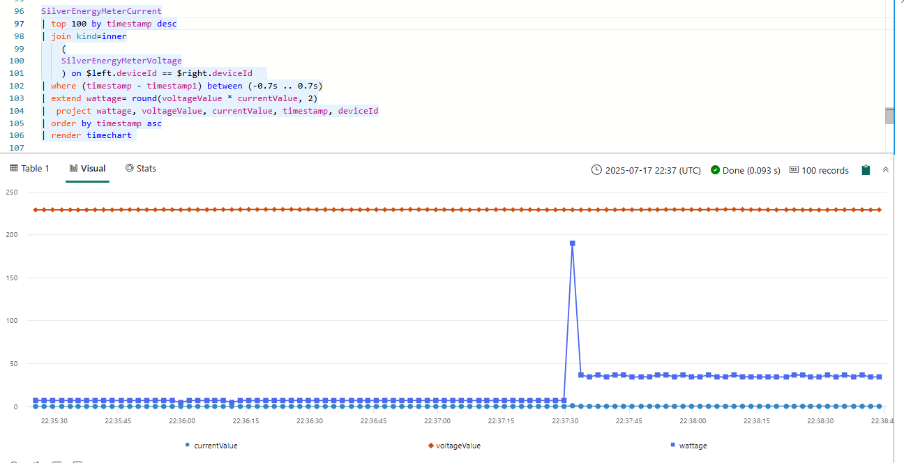

44. Here, the electric motor just started, resulting in a large spike due to the huge amount of current needed to get it running. The measurement was taken just at the right moment.

   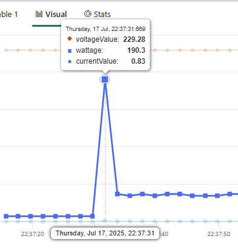

45. It must be clear that all new BronzeEnergyMeter rows are duplicated and distributed over the two Silver tables. If you are confident this works as expected, the retention time of the bronze table can be reduced so the database stores less data. **Change the retention time** to one hour. This is not a soft deletion.

```
.alter-merge table BronzeEnergyMeter policy retention softdelete = 1h recoverability = disabled
```

46. If you **count the number of rows** in both bronze table with eg. `BronzeEnergyMeter | count` and silver tables at the end of this workshop, you will notice that the oldest rows in the bronze table will span one hour. This is not an exact life span; the process behind removing outdated rows has a very low priority, but it will be executed for sure.

47. One more thing. Do you remember that Derived stream in the Eventstream? Let's **visit** the `Real-Time Hub` to check out what this looks like for other users. On the portal menu at the left side of your Fabric portal, **select** `Real-Time`.

   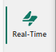

48. If a Welcome dialog is shown, **press** `Get started` (leave the checkbox unchecked to take the tour later on).

   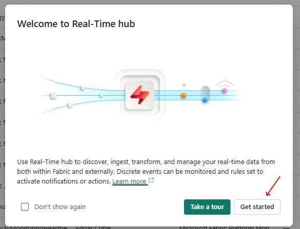

49. The Real-Time Hub shows all data streams accessible to you. It even offers a starting point for creating new ones. Our derived stream `EnergyMeterDeriveStream` is listed here too.

   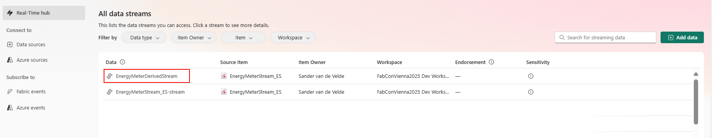

50. The `EnergyMeterDeriveStream` offers a 'Preview data' option. **Click on the eye** next to it.

   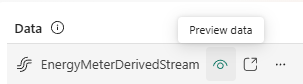

51. A new dialog shows both a chart with the number of ingested rows over the last six hours at the top and a preview of rows at the bottom.

   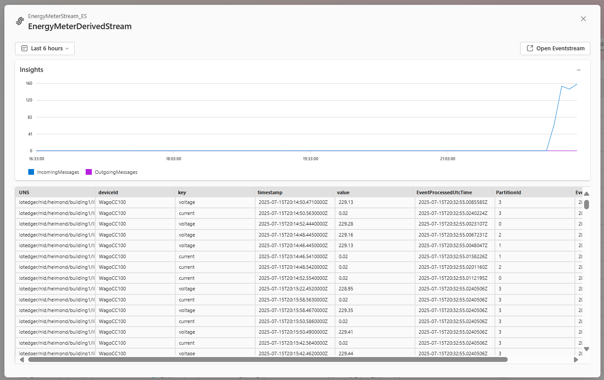

We now have a solid stream of Energy meter data, ingested from the Edge to the cloud using both Azure IoT Operations and Microsoft Fabric. We have also experienced how the KQL query language helps us regarding the bronze-silver-gold medallion architecture to cope with ingested data and turning it into value.

Let's ingest LoraWan telemetry from all kinds of LoraWan sensors, implemented in a demo factory (like temperature sensors, vibration sensors, and even location trackers). We are especially interested in the telemetry sensors.

### 4. Lab 03.2 - Create a new LoraWan Telemetry Eventstream

In this section, we will be streaming LoraWan telemetry events (temperature events). The events will be streamed into an Eventstream and written into our Eventhouse KQL Database.

LoraWan is a communication protocol for communication over very long distances (eg. 5-10 kilometers), optimized for low-powered devices.

In this case, multiple kinds of LoraWan devices (here: temperature sensors) send out small messages, being picked up by a community network of The Things Network and sent to that 3rd party cloud solution.

Using an Azure IoT Hub connection the LoraWan messages are routed to an Azure Event Hub.

You will ingest the LoraWan data from an Azure Event Hub.

   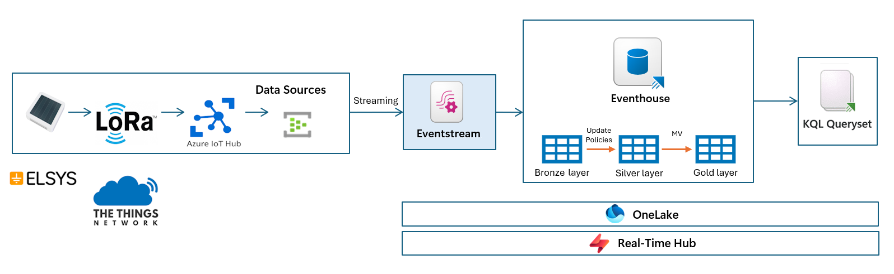

1. **Open** the Eventstream named `ES_LoraWanStream`, already provided in the 'Factory events folder'. On the Screen 'Design a flow to ingest, transform, and route streaming events' **click** on `Connect data sources`.

   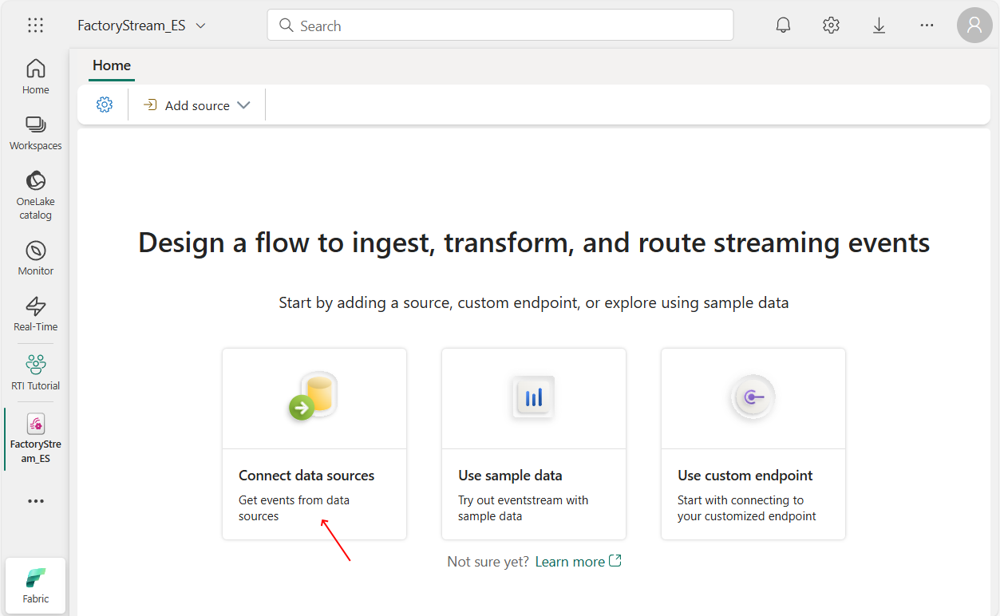

2. **Click** `Select a data source`. In the dialog **click** on the button `Connect`.

   

3. In the dialog 'Configure connection settings' **choose** `loratelemetryeventhub` for the combobox 'Connection' and **insert** the name of the consumer group into the field 'Consumer group' that aligns with the username that was provided to you. In my case, this is `workshopuser49`. **Ensure** that the 'Data format' is `Json` and **click on the pencil** icon next to 'Source name'.

   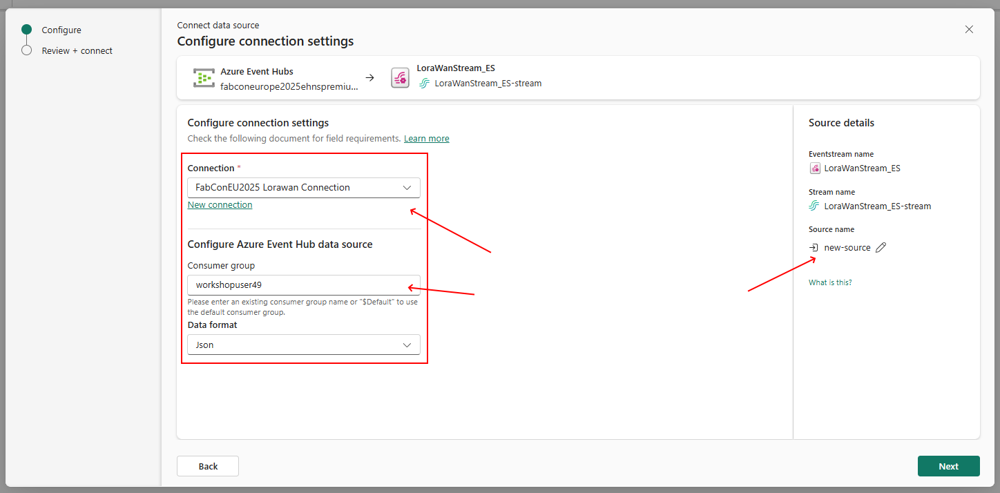

4. **Enter** `LoraWanEventsSource` as 'Source name' and then **click** on the button 'Next'.

   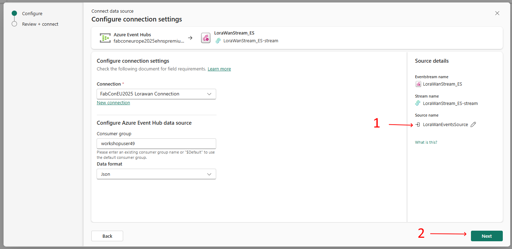

5. On the screen 'Review + Connect', **review** all of the information and then **click** on the button `Add`.

   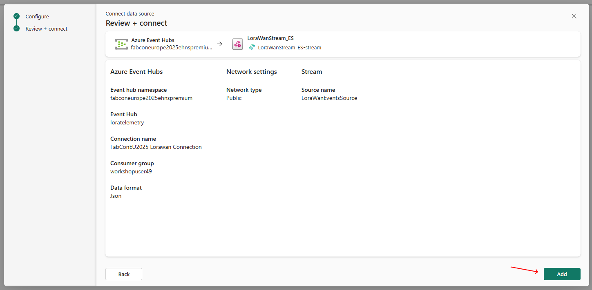

6. The source is added. **Notice** that raw data from several (types of) devices is received.

   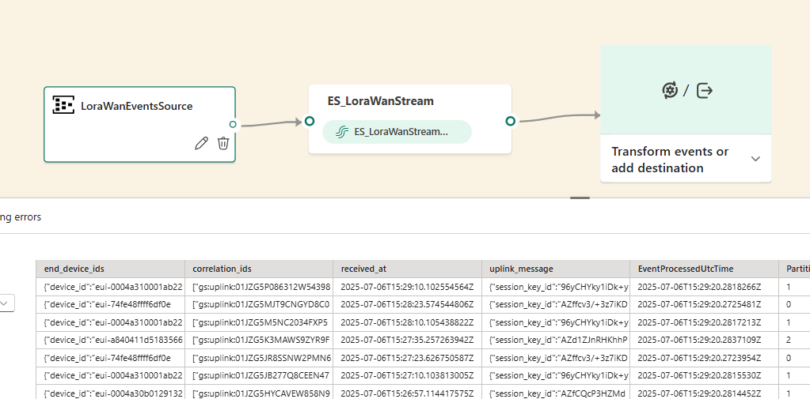

7. Do not worry about the complex data in the columns, we will fix that. In the 'Destination' section of the 'Transform events or add destination' dropdown of the green item at the right side of the flow, **Select** Fabric `Eventhouse`.

   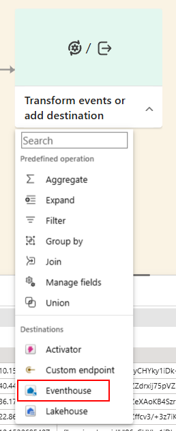

8. We **select** `Direct Ingestion`, not 'Event processing before ingestion'! So, we need to add a table mapping later on. Also, **provide** the 'Eventhouse' named `FactoryEvents_EH` and 'KQL Database' named `FactoryEvents_EH` as seen in the previous paragraph. **Save** the settings (this can take a moment to set up the connection, please be patient).

   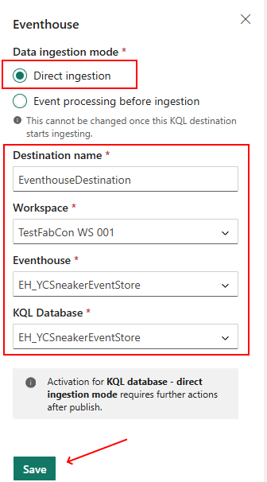

9. Before we **publish** the Eventstream, **make sure** we see the test results when the `middle step` is active. **Refresh** these results to be sure the mapping is providing sample telemetry, before continuing.

   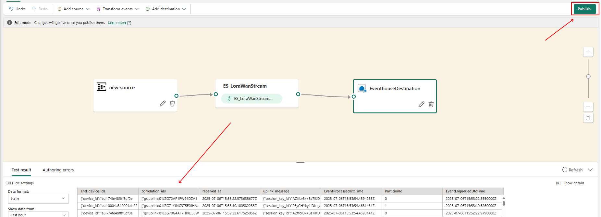

10. Once the Eventstream is published, the Eventhouse destination needs extra configuration for the table mapping. **Configure** the mapping.

   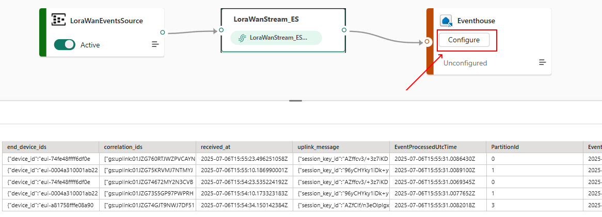

11. In the new 'Get data' dialog, we create a new table in the `FactoryEvents_EH` KQL Database. **Click** `New Table`.

   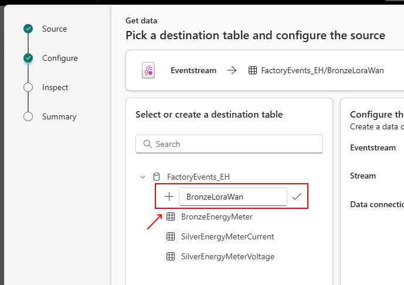

12. **Fill in** `BronzeLoraWan` as the 'Table name'. **Accept** the data source connection name. **Go to** the `next` page to create a mapping.

   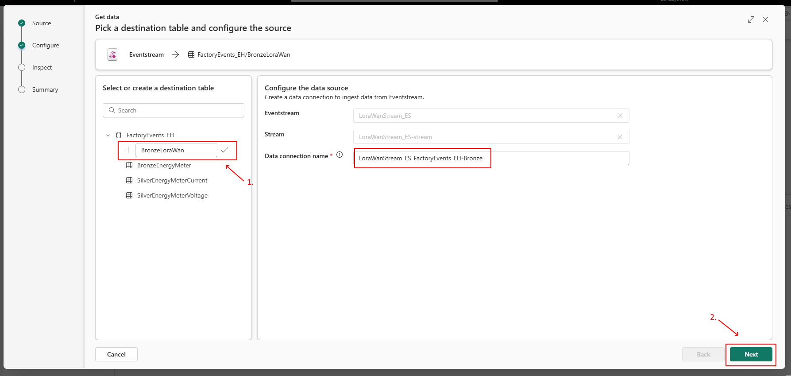

13. The incoming LoraWan messages are available in the JSON format. Here, we demonstrate how we can use the KQL table mapping to shape the message to columns in the table. First, we **start** by `changing the Nested levels to 0 (zero)`. This results in one column of the 'dynamic' type containing the complete message. Use the `pencil` to **change the mapping**, adding extra columns.

   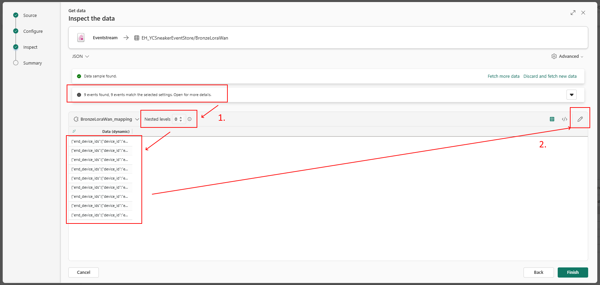

14. In the new dialog, we see that one column is named 'Data'. Notice that the type is 'dynamic'. **Add a second column**.

   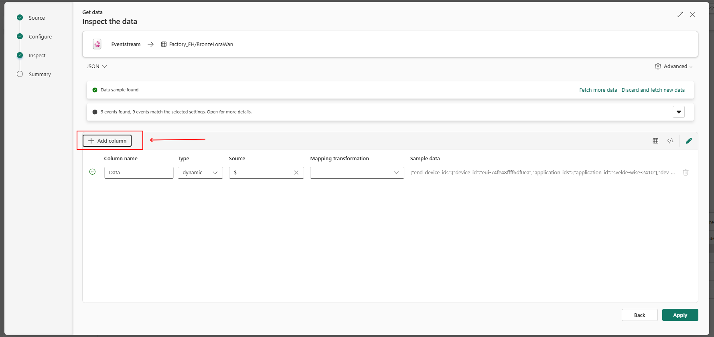

15. **Name** the second column `deviceId`. The type is 'string'. Add a source by opening the drop-down list.

   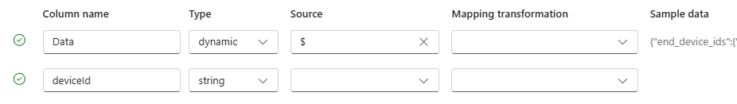

16. Select **Create new source** for deviceId.

   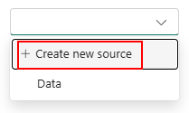

17. **Set the source** to `.end_device_ids.device_id` (The dollar sign represents the 'root' of the full JSON message. Together with that dollar sign and a dot, this makes the JSON path '$.end_device_ids.device_id').

   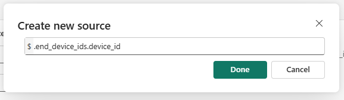

18. The second column looks like this. Notice the sample.

   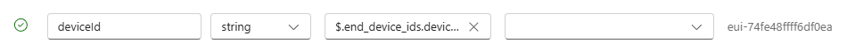

19. **Add a third column** named `applicationId` of type 'string' with 'create new source' `.end_device_ids.application_ids.application_id` (so the JSON path is '$.end_device_ids.application_ids.application_id').

   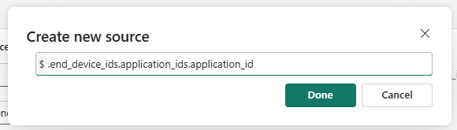

20. This third column looks like this. Notice the sample.

   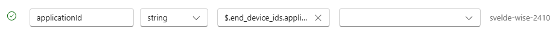

21. **Add a fourth column** named `timestamp` of type 'datetime' with 'create new source' `.received_at` (so the JSON path is '$.received_at'). Make sure you change the type to `datetime` (instead of 'string').

   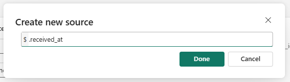

22. This fourth column looks like this (notice the 'datetime' type). Notice the sample.

   

23. We have all the columns we need at this moment. This should look like this.

| Column | Name | type | New source |
| - | - | - | - |
| 1 | Data | dynamic | $ |
| 2 | deviceId | string | $.end_device_ids.device_id |
| 3 | applicationId | string | $.end_device_ids.application_ids.application_id |
| 4 | timestamp | datetime | $.received_at |

24. **Apply** the mapping.

   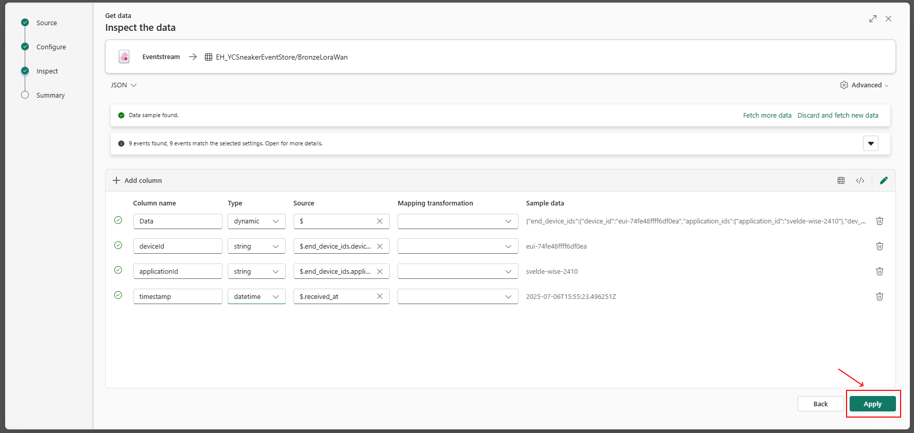

25. In the overview of the mapping, all four rows are now showing the new mapping. **Finish** the mapping.

   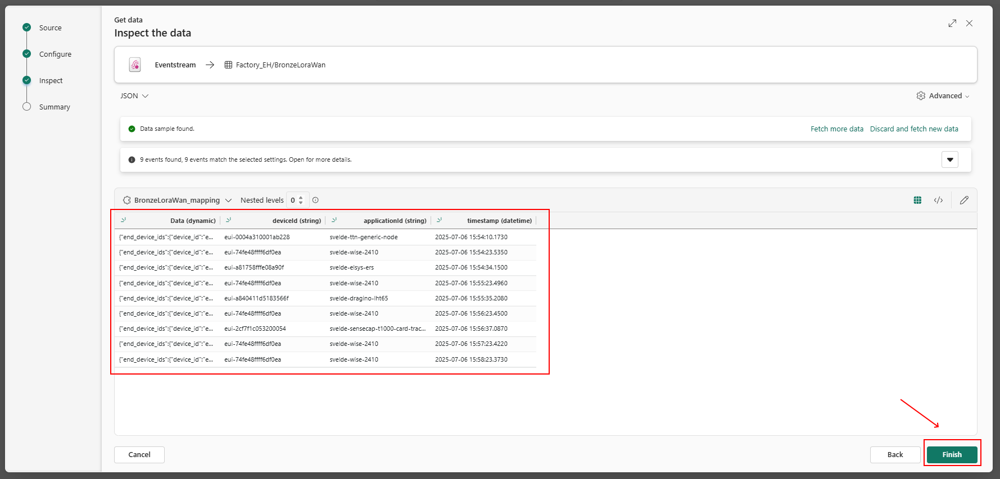

26. In the summary, we see the creation of the table, the JSON mapping, and the data connection. **Close** the dialog afterwards.

   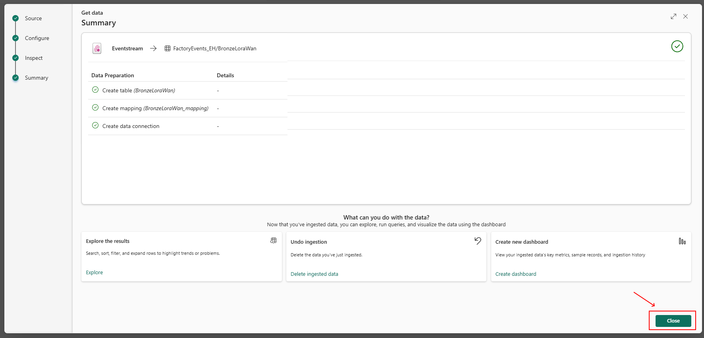

27. In the Fabric portal, **navigate** to the `BronzeLoraWan` table, part of the 'FactoryEvents_EH' KQL Database in the 'FactoryEvents_EH' Eventhouse. This table shows four columns.

   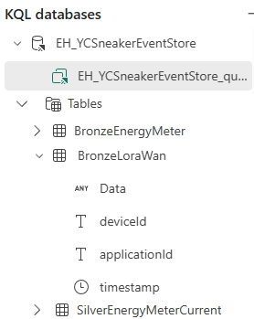

28. In the Eventhouse KQL Database 'FactoryEvents_EH' KQL Queryset `FactoryEvents_EH_queryset`, check the JSON table mapping by **running this command**.

```
.show table BronzeLoraWan ingestion json mappings
```

29. This results in this mapping, complete with all JSON paths.

   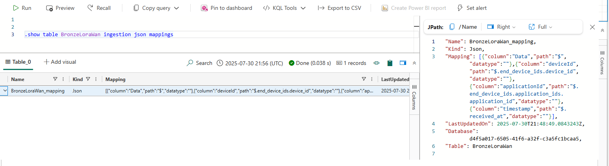

30. The LoraWan table is filled with messages from all kinds of devices. We are especially interested in the environmental values (temperature, humidity) of the Elsys ERS Eco sensors. **Run this KQL query** to see if these are already arriving in our Eventhouse (notice this can take a few minutes because the LoraWan sensors only provide telemetry every five minutes, due to preserving energy as a low-powered device).

```
BronzeLoraWan
| where applicationId == 'svelde-elsys-ers'
```

31. Here, two different sensors (if available, check the `deviceId`) are providing temperature-related telemetry rows. Notice that the `Data` column is written in JSON and is hard to read.

   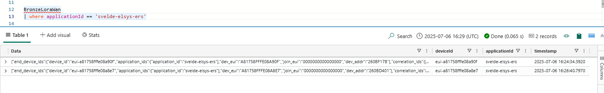

32. **Run this KQL query** to get all details from all available sensors in the 'svelde-elsys-ers' application.

```
BronzeLoraWan
| where applicationId == 'svelde-elsys-ers'
| project applicationId, deviceId, timestamp, 
          humidity = toint(Data.uplink_message.decoded_payload.humidity), temperature = todouble(Data.uplink_message.decoded_payload.temperature),
          light = toint(Data.uplink_message.decoded_payload.light), battery = toint(Data.uplink_message.decoded_payload.vdd) 
| order by timestamp desc
```

33. The KQL Query Language (KQL) makes it very easy to get nested values from a JSON-formatted dynamic. The values returned are of type 'dynamic' too. To actually calculate with these values, we also need to convert the type (eg. `todouble()`) too.

   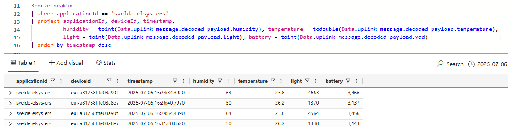

34. To prevent having to filter the temperature values constantly, including getting the nested values and formatting, we **create** a `SilverLoraWanTemperature` table first.

```
.create table SilverLoraWanTemperature (applicationId : string, deviceId : string, timestamp : datetime, humidity: int, temperature: double, light: int, battery: int) 
```

35. **Run** that table creation command.

   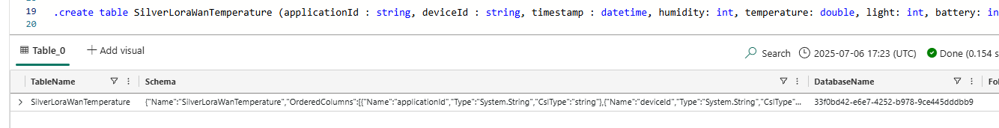

36. In the KQL database `FactoryEvents_EH`, **notice** that the table is created.

   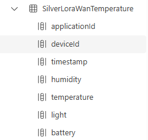

37. To have it filled automatically when new rows arrive at the `BronzeLoraWan` table, we make use of a 'table update policy'. For each new row in `BronzeLoraWan` table, a KQL function will be executed, doing all the conversions towards the `SilverLoraWanTemperature` table. To keep the mapping simple, we only look at devices in the 'svelde-elsys-ers' application. **Run this KQL command**.

```
.create function
with (docstring = 'Ingest Temperature LoraWan Data', folder='ingestLoraWan')
ParseTemperatureLoraWanData()
{
BronzeLoraWan
| where applicationId == 'svelde-elsys-ers'
| project applicationId, deviceId, timestamp, 
          humidity = toint(Data.uplink_message.decoded_payload.humidity), 
          temperature = todouble(Data.uplink_message.decoded_payload.temperature), 
          light = toint(Data.uplink_message.decoded_payload.light), 
          battery = toint(Data.uplink_message.decoded_payload.vdd) 
}
```

38. The KQL function is created.

   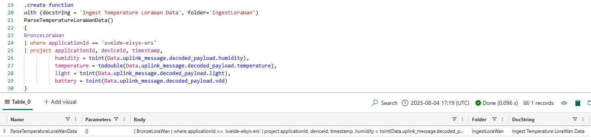

39. Alter the `SilverLoraWanTemperature` table by adding this 'table update policy' so the `ParseTemperatureLoraWanData` function is executed each time the BronzeLoraWan table gets new rows. **Run this KQL command**.

```
.alter table
SilverLoraWanTemperature 
policy update @'[{"Source": "BronzeLoraWan", "Query": "ParseTemperatureLoraWanData", "IsEnabled" : true, "IsTransactional": true }]'
```

40. The table update policy is added.

   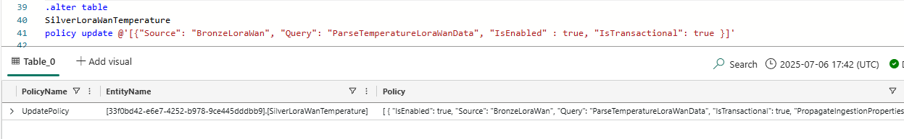

41. **Wait** a few minutes **and see** if the temperature sensor data is forwarded to the `SilverLoraWanTemperature` table, containing typed data (refresh a few times).

42. **Execute this KQL Query**, reading all rows in the table.

```
SilverLoraWanTemperature
```

43. The output should look like this.

   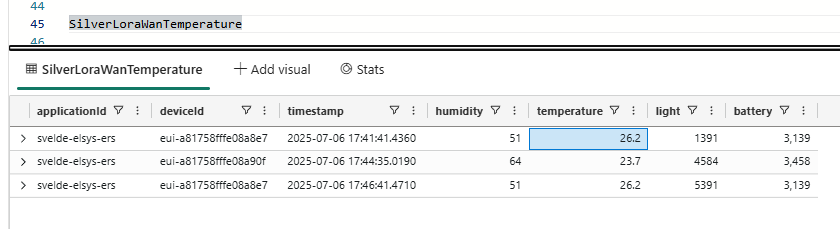

44. In the KQL Database, the `SilverLoraWanTemperature` provides several options to work with the data by **clicking the 'three dots'** so this menu pops up. **Select Visual Exploration**.

   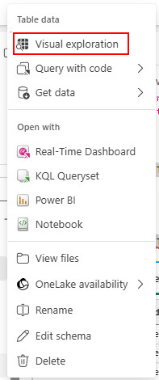

45. A new dialog is shown with table column details (like minimum and maximum values) to the right and rows in the Results pane. **Play around** with the Columns pane by providing 'deviceId' as column name.

   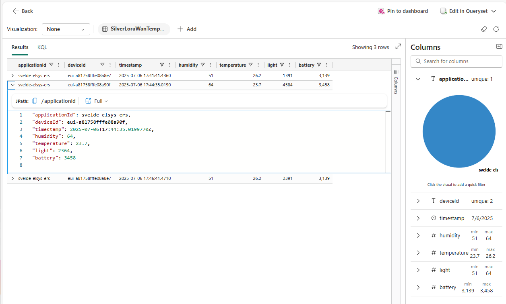

46. **Change the visualization** to 'Line chart' or any other applicable visualization.

   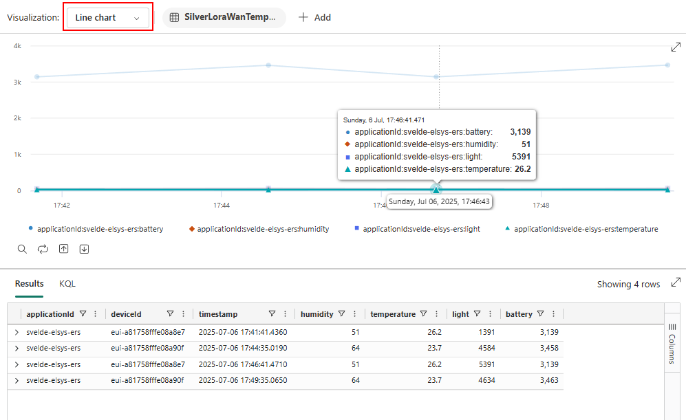

We have seen how we can ingest LoraWan telemetry from multiple devices via one Eventstream. The telemetry is ingested into a Bronze LoraWan table in the KQL Database via an elaborate table mapping. The Eventhouse supports the Medallion Architecture via table Update policies. Here, a Silver LoraWan table with temperature sensor telemetry is filled, complete with the correct column types. We have also seen how we can use the no-code Visual Exploration to check the data in more detail. In the next paragraph, we will complete the temperature sensor data with data from a real-time weather data service.

### 4. Lab 03.3 - Activator alerts based on high temperatures 

In this section, we will extend the LoraWan solution with an Activator, sending alerts under certain conditions. In our demo factory, the production output will have lower quality when the temperature in the factory is higher than 30 degrees Celsius. The Activator will send alert messages based on temperatures higher than 30 degrees Celsius within the factory, measured by our LoraWan temperature sensors. 

   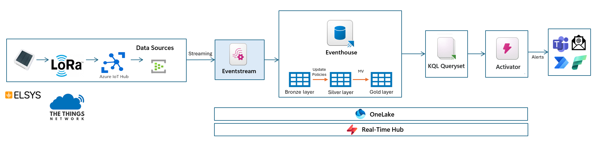

1. **Create a new tab page** in the KQL Queryset and name it `temperature alert`. In this new tab page, **Add this KQL query**.

```
let cutoff = ago(15m);
SilverLoraWanTemperature
| where timestamp > cutoff
| project timestamp
      , temperature 
      , applicationId = strcat(applicationId , '-' , deviceId)
| render linechart 
```

2. This query shows all temperature values measured by our LoraWan temperature sensors over the last 15 minutes in a line chart.

   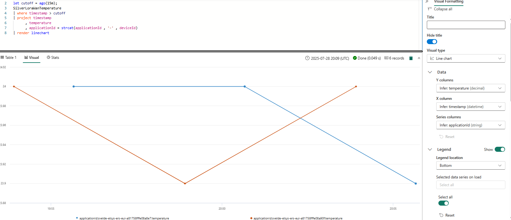

3. Within the KQL Queryset, we can turn any query into an alert. Here, we create an alert when any temperature value is above 30 degrees Celsius. **Put the focus on the KQL query** by placing the cursor in it. Then **select** `Set alert` from the menu bar.

   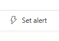

4. A new dialog is shown for setting alerts from a KQL Queryset. This will create an Activator afterwards. **Set the following values**. Run the KQL query `every 15 minutes`. We group the temperatures using the `applicationId` as the grouping field. We are interested in alerts only when `the temperature becomes greater than 30`, so we only get that message when it becomes greater than 30, not when it stays greater than 30 (This limits the amount of alert messages). The alert `should be an email`. (Notice that you potentially have no access to the email inbox due to the account used in this workshop.)

   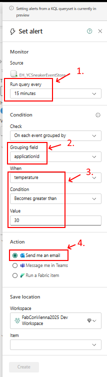

5. The last step is setting up a new Activator (notice that this makes it possible to add multiple alerts to one Activator). **Create a new item**.

   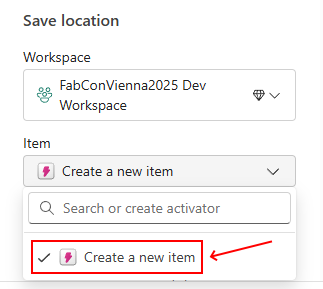

6. Name the new Activator `FactoryEvents_ACT` and **press the Create button**.

   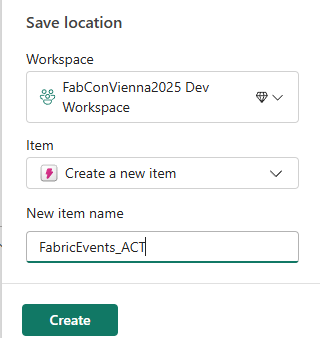

7. Within a few moments, the alert is created within the new Activator. **Press the Open button** to navigate to the new Activator.

   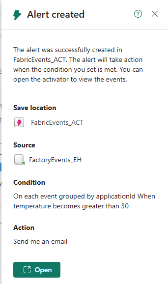

8. **Change the time** to the last `30 minutes`. In the monitor part of the page, we see all recent temperature values in that time span. Notice that probable all values in this example are well below the alert limit of 30 degrees Celsius. To force having alerts, change the temperature limit in the definition. **Change it to** `somewhere near and below (some of) the values` in the Y-axis of the Monitor graph. A 'horizontal red line' appears in the Monitor graph at that value you have chosen. In this case it's '23.5'.

   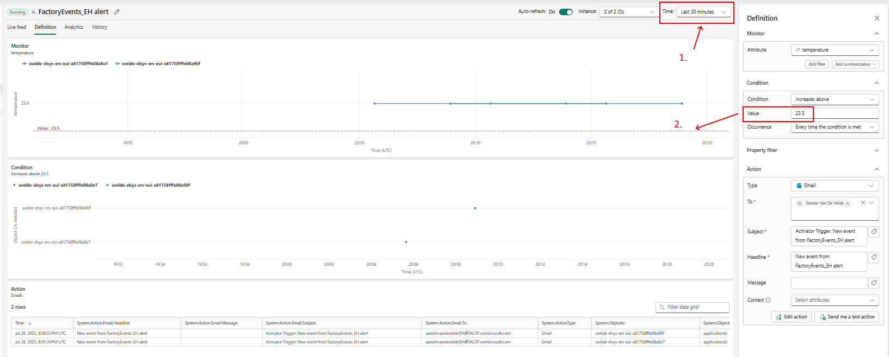

9.  First, if that limit is low enough, some temperature values (but not all) will pass that threshold and will pop up in the Condition part. These will end up as Actions, seen at the bottom. Second, notice that in this example, where all temperature values are at the same level, `only the first two values` (for each sensor one value) leads to actions. The following temperature values are ignored because the action condition is based on 'becomes greater than' (the Activator handles this as 'Increases above').

   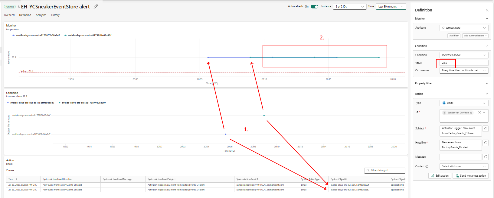

10. As shown in the Definition, the action will be an email. **Change the message**. The message could be `Temperature too high `. This text can be enriched by adding a property referencing the current temperature. First, **Click** on the `tag` icon and then select `temperature`.

   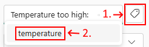


11. **Add** the same `temperature` as context.

   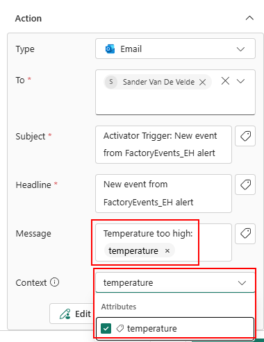

12. A alternative edit option is available. **Press the 'Edit action' button**.

   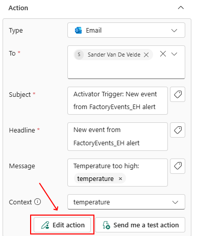

13. This will provide the same editing experience, together with a preview of the email to expect. Optionally, you can ask for a test action to be sent. (Notice that access to the email inbox could be limited depending on the account used for this workshop) **Discard changes** afterwards.

   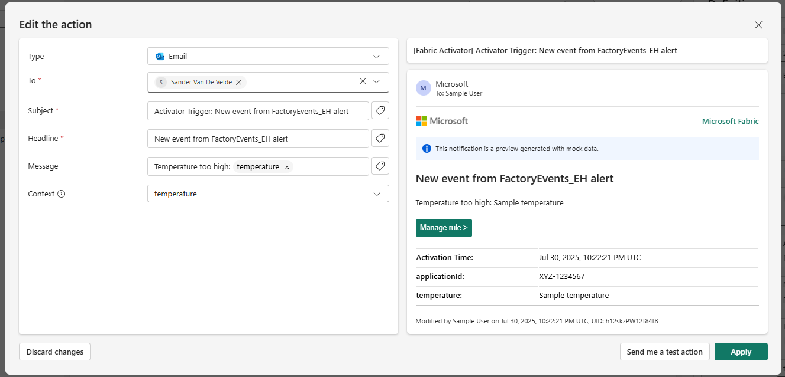

We have experienced how we can use an Activator to turn events and KQL queries under certain conditions into actions like sending an email or a Teams message. It's even possible to attach Power Automate actions.

Here, we used the KQL Queryset to trigger events. Within Microsoft Fabric, Activator integration is available at more places such as an Eventstream destination or PowerBI report integration.

### 4. Lab 03.4 - Create a new Weather data Eventstream

At this moment, we get energy meter telemetry from an electric motor within our demo factory and from several temperature sensors placed within the factory.

In this section, we will add real-time weather data events. These events are streamed into an Eventstream using a real-time weather data source and are ingested into our Eventhouse KQL Database.

   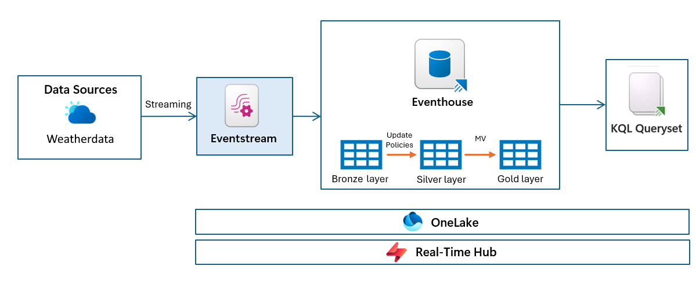

1. **Open** the Eventstream named `ES_WeatherData`, already provided in the 'Factory events folder'. On the Screen 'Design a flow to ingest, transform, and route streaming events' **click** on `Connect data sources`.

   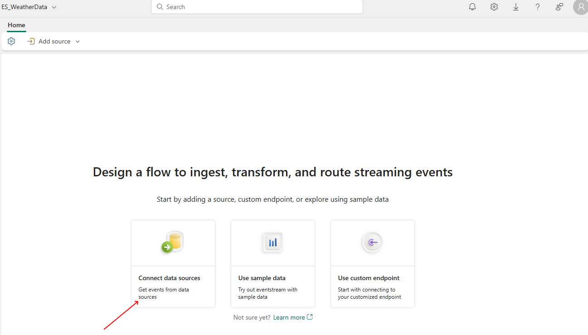

2. **Click** `Select a data source`. In the dialog **click** on the menu item `New`.

   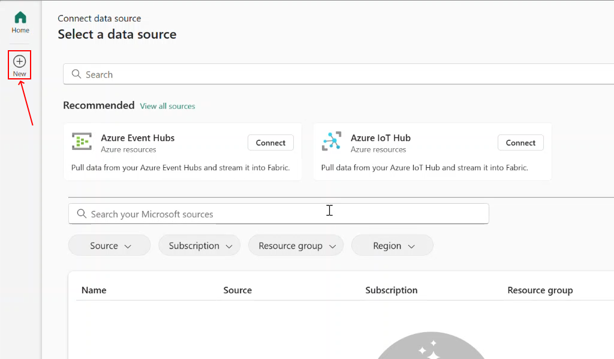

3. On the next page, **filter** the list of data sources for 'weather' and **connect** the `Real-time weather data` source.

   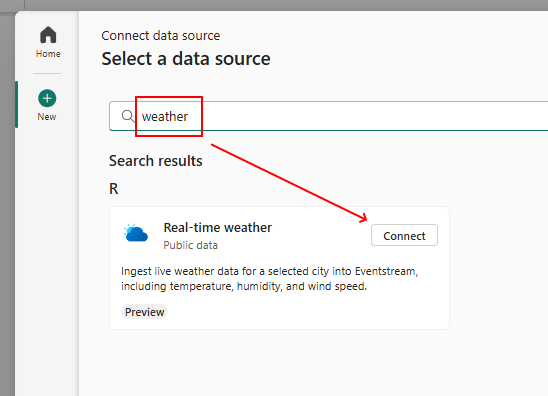

4. In the dialog 'Configure connection settings', **select** a location to ingest real-time weather data. Either **put a pin** somewhere on the map (use the zoom buttons to get a better view) or **type in a location name** like `Helmond-West, Helmond NL` and use the drop-down to get the specific location.

   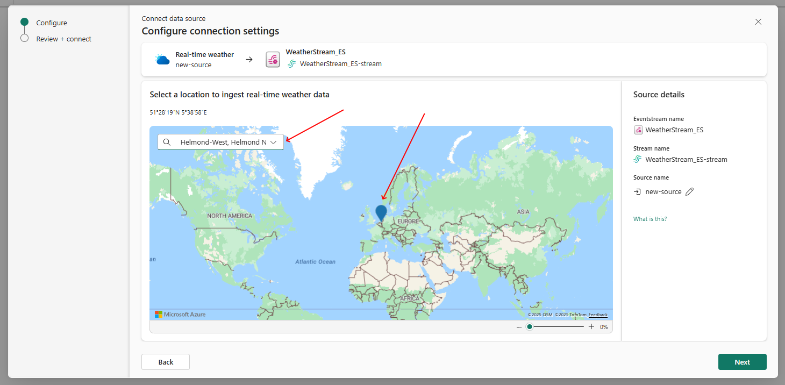

5. **Enter** `WeatherEventsSource` as 'Source name' (using the pencil) and then **click** on the button `Next`.

   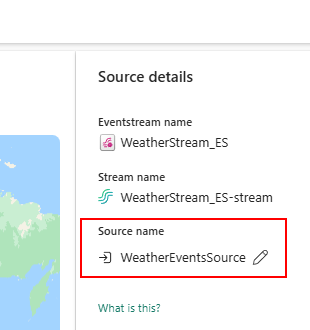

6. On the screen 'Review + Connect', **review** all of the information and then **click** on the button `Add`.

   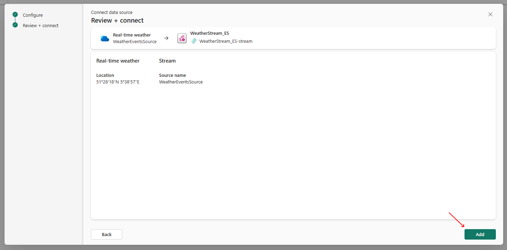

7. The source is added to the flow. **Check** for the arrival sample weather data on the Data preview tab.

   

8. The arriving weather data should be sent to the Eventhouse we just created. **Add** an `Eventhouse destination` from the top menu bar 'Add destination' drop down list.

   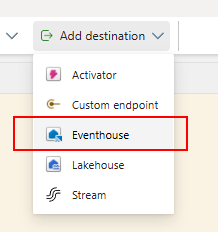

9. First, **select** `Direct ingestion`, not 'Event processing before ingestion'! So, we need to add a table mapping later on as seen in the information box. Second, **Give** this destination a proper 'name' like `EventhouseDestination`. Last, **Select** the Eventhouse and KQL Database we just created as the destination.

   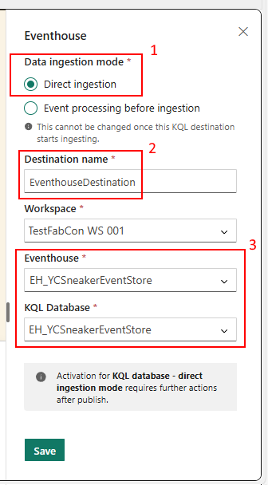

10. **Save** the destination settings.

11. If the Destination is not yet connected to the source, you see this error sign. In that case, just **connect** the `output point` of the 'WeatherStream_ES' to the `input point` of the EventhouseDestination.

   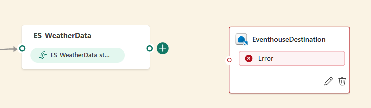

12. Make sure you first **hit** the `refresh` button while the `middle flow item` is selected, before publishing this Eventstream. The next steps rely on sample data for the Eventhouse direct ingestion.

   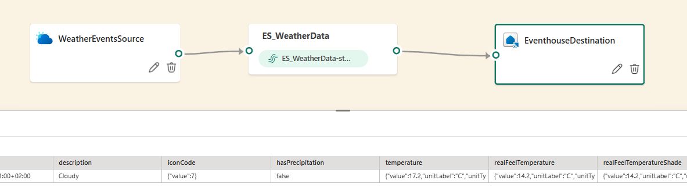

13. Once the destination is connected, **Publish** the Eventstream. This will show the `live` version. **Wait** until all resources are created, this can take a moment until 'loading' has finished.

   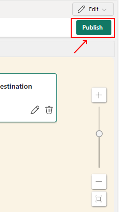

14. **Hit** the `Configure` button on the 'Destination', picking a 'destination' table and 'configure' the source. This is the first step of the Get Data wizard.

   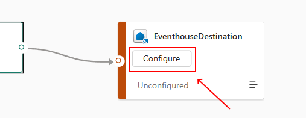

15. We **create a new table** in the KQL Database for the weather data. Name it `BronzeWeather`. Once the table name is accepted, and a data connection is created. Go to the **Next** page.

   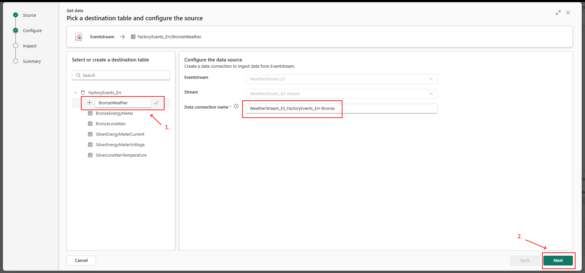

16. The table mapping is suggested based on incoming sample data. Notice the 'Waiting for data from the event stream. This could take a few moments' message. **Notice** that one or more rows should be found to support the mapping. The wizard gives us the option to add, remove, and change column values. Here, although not the most perfect mapping (some columns still contain 'Json' values), we **keep this proposed JSON mapping** and, **Finish** the wizard.

   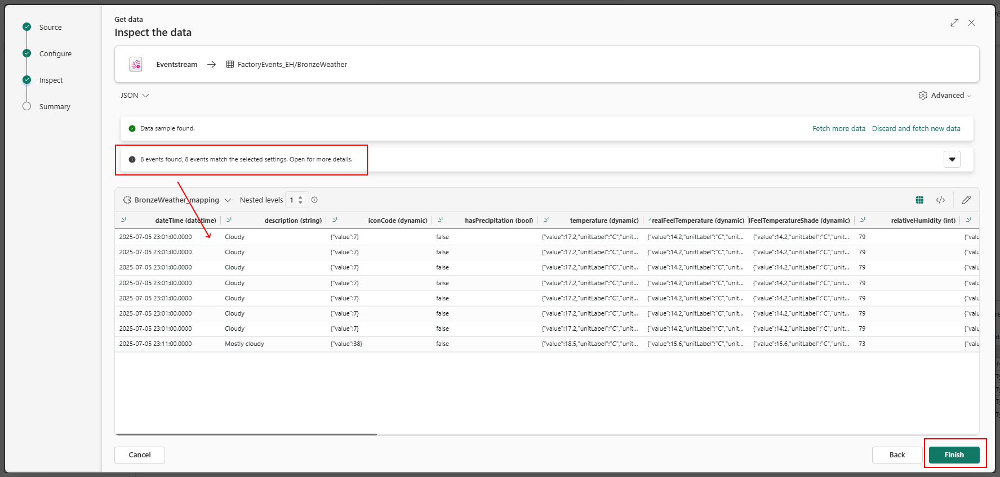

17. A summary is shown. We see the table is created, together with the mapping and data connection. **Explore the results** by hitting `Explore` instead of 'close'.

   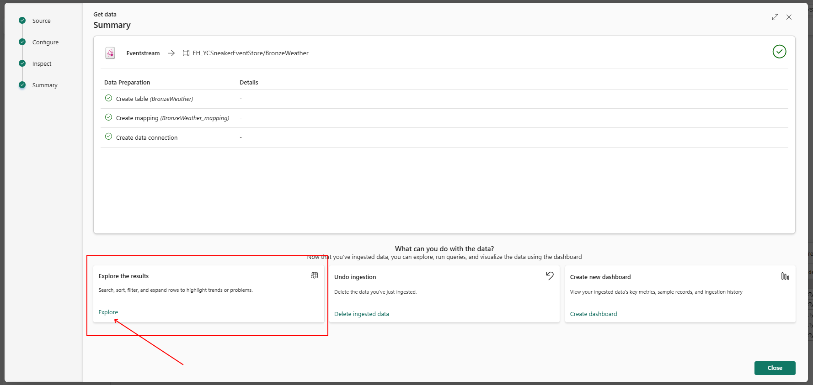

18. Exploring time series data is done using the KQL Queryset. The predefined query '['BronzeWeather'] | take 10' makes use of the KQL `take` statement, showing a number of random rows in a table if available. **Hit the Run button** while the cursor is placed in the query to execute it. Walk through the different columns of the real-time weather data to get a better understanding of the data arriving. Notice that the original location of the weather data is provided. You will notice two more things:

* Duplicate rows for the same location and timestamp (see column dateTime) are generated by the real-time weather data service. 
* Almost all columns have 'dynamic' values with sub-values in them.

   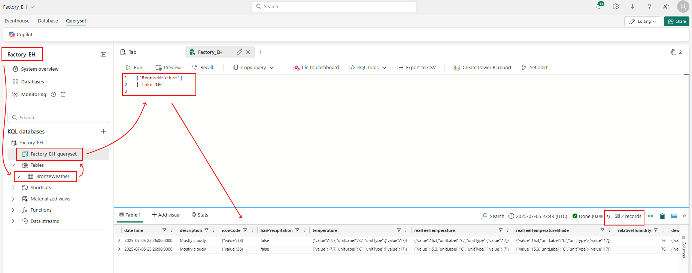

19. We have fixed the dynamic columns yet in the table mapping. Run this KQL command to show the table mapping as it is now in the bronze table.

```
.show table BronzeWeather ingestion json mappings 
```

20. This results in this simple mapping.

   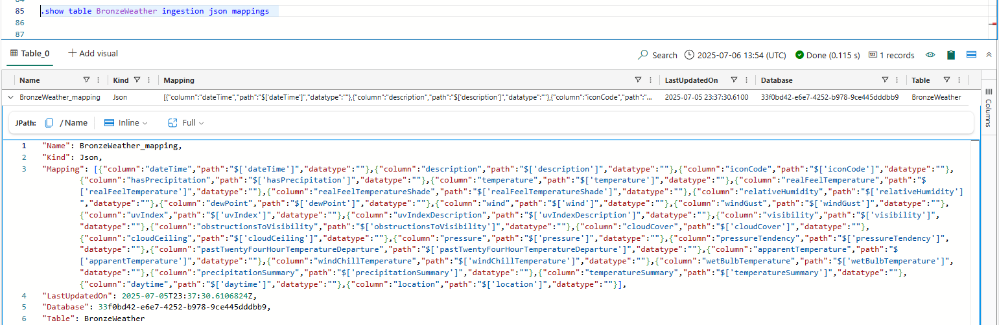

21. Now, let's check the content of the `BronzeWeather`. **Run** this query.

```
BronzeWeather
| order by dateTime asc
```

22. We see both duplicate rows in the table and most columns work with dynamic field having dynamic 'json' values.

   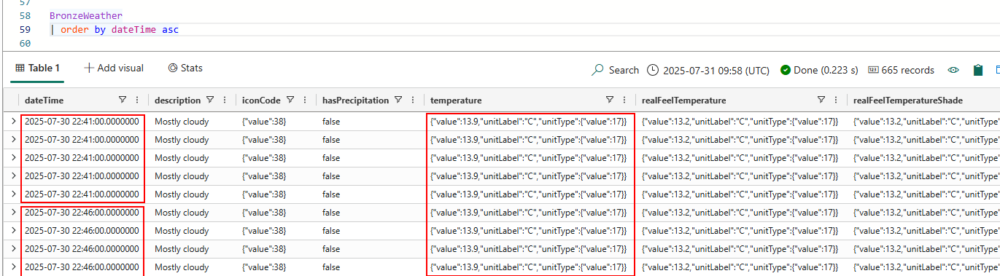

23. Let's fix both 'flaws' by creating a 'silver' layer using a Materialized View. Unlike a view in eg. SQL Server, each row in this view is actually persisted after creation, so it's very fast when used for querying. **Add and run this materialized view** first: 

```
.create materialized-view with(lookback=20m, lookback_column = "dateTime", backfill=true, docString="Unique Real-Time Weather Service data entries", folder="MaterializedViews") SilverWeather on table BronzeWeather
{
BronzeWeather
| project dateTime, 
description, 
iconCode = toint(iconCode.value), 
hasPrecipitation, 
temperature = todouble(temperature.value),
realFeelTemperature = todouble(realFeelTemperature.value),
realFeelTemperatureShade = todouble(realFeelTemperatureShade.value),
relativeHumidity = toint(relativeHumidity),
dewPoint = todouble(dewPoint.value),
windDirectionDegrees = toint(wind.direction.degrees),
windDirection = wind.direction.description,
windSpeed = todouble(wind.speed.value),
windGustSpeed = todouble(windGust.speed.value),
uvIndex = toint(uvIndex),
uvIndexDescription,
visibility = todouble(visibility.value),
obstructionsToVisibility,
cloudCover = toint(cloudCover),
cloudCeiling = toint(cloudCeiling.value),
pressure = todouble(pressure.value),
pressureTendency = pressureTendency.description,
pastTwentyFourHourTemperatureDeparture,
apparentTemperature = todouble(apparentTemperature.value),
windChillTemperature = todouble(windChillTemperature.value),
wetBulbTemperature = todouble(wetBulbTemperature.value),
precipitationPastHour = todouble(precipitationSummary.pastHour.value),
precipitationPast3Hours = todouble(precipitationSummary.past3Hours.value),
precipitationPast6Hours = todouble(precipitationSummary.past6Hours.value),
precipitationPast9Hours = todouble(precipitationSummary.past9Hours.value),
precipitationPast12Hours = todouble(precipitationSummary.past12Hours.value),
precipitationPast18Hours = todouble(precipitationSummary.past18Hours.value),
precipitationPast24Hours = todouble(precipitationSummary.past24Hours.value),
temperaturePast6HoursMinimum = todouble(temperatureSummary.past6Hours.minimum.value),
temperaturePast6HoursMaximum = todouble(temperatureSummary.past6Hours.maximum.value),
temperaturePast12HoursMinimum = todouble(temperatureSummary.past12Hours.minimum.value),
temperaturePast12HoursMaximum = todouble(temperatureSummary.past12Hours.maximum.value),
temperaturePast24HoursMinimum = todouble(temperatureSummary.past24Hours.minimum.value),
temperaturePast24HoursMaximum = todouble(temperatureSummary.past24Hours.maximum.value),
daytime = tobool(daytime),
latitude = todouble(location.latitude),
longitude = todouble(location.longitude)
| summarize arg_max(dateTime, *) by dateTime, longitude, latitude
}
```
24. We now have a materialized view with typed data.

   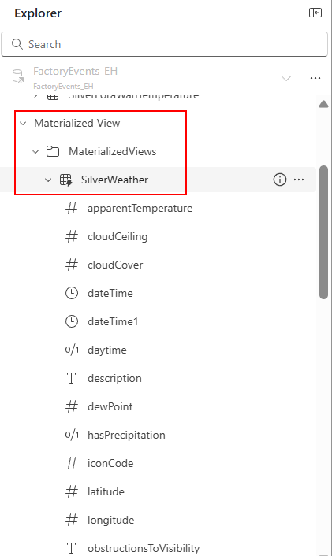

25. The rows are de-duplicated per location. **Run** this query.

```
SilverWeather
| order by dateTime asc
```

26. Notice that we can now work with the right column values and without duplicate rows (per location).

   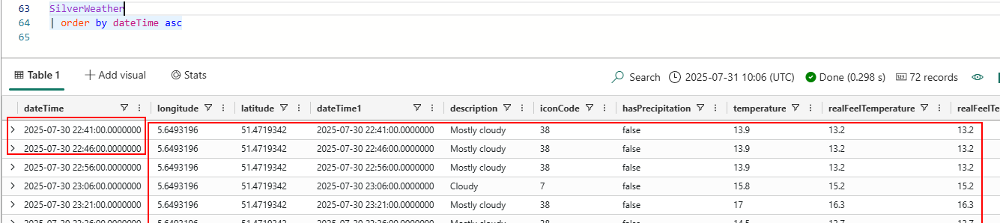

27. Regarding the bronze table, we do not need to remember all old rows because the materialized view will remember all historical rows. Deleting obsolete 'bronze' rows can be automated. **Run this command** so the BronzeWeather table gets a one-hour retention.

```
.alter-merge table BronzeWeather policy retention softdelete = 1h recoverability = disabled
```

<div class="important" data-title="Note">

> Applying the retention is a low-priority process. Rows will be removed at some point, but not instantly.

</div>

28. Let's have some fun with the view. **Run this KQL query** to see the number of rows per location.

```
SilverWeather
| summarize count() by longitude, latitude
```

29. This results in a table like this.

   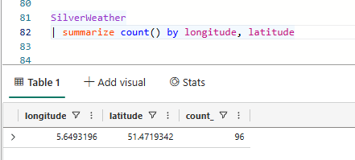

30. Let's create a map showing the latest location. **Run this KQL query**.

```
SilverWeather
| top 1 by dateTime desc
| extend label = strcat("Temp: ", temperature, ", Humidity: ", relativeHumidity, ' at ', dateTime)
| render scatterchart with (
    kind = map,
    title = "World Map of Temperature and Humidity"
)
```

31. This results in a map like this.

   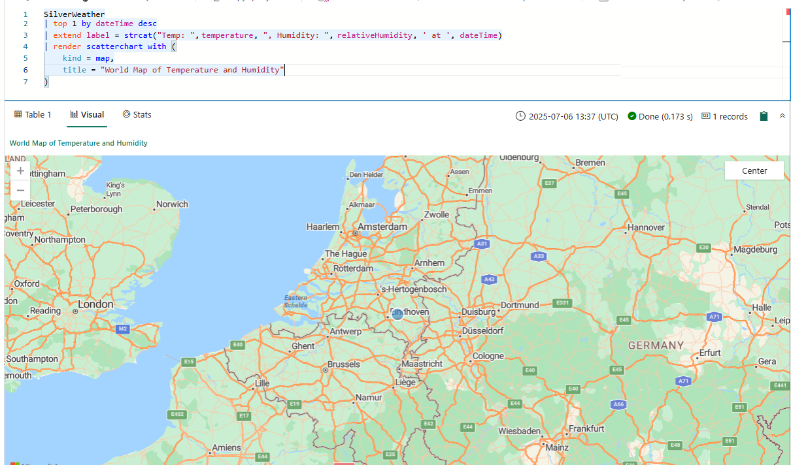

32. In the Visual Formatting, **change the Label column** into 'label'.

   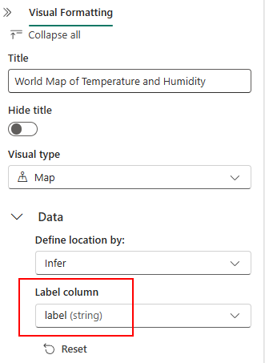

33. If you **hover over the location you selected**, you will see a label pop up.

   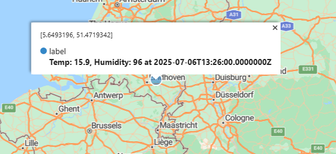

We have learned how to ingest Real-time Weather data from a source via the EventStream and forward it to a KQL Database table via a table mapping and a data stream. We can even render maps in the editor for data exploration.

We also learned how we can query the table using the KQL query language using a KQL Queryset.

Finally, we learned about using a materialized view to de-duplicate rows and adding a retention time to limit the data storage.

### 4. Lab 03.5 - Turning a KQL query into a dashboard for sharing

In this section, we mix the environmental data from the LoraWan sensors with the Real-Time weather data. The events will be queried both in a KQL Queryset and a Real-Time dashboard.

   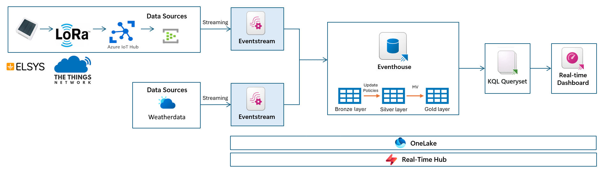

1. Let's mix the environmental data from the LoraWan temperature sensors with the Real-Time weather data. **Execute this query**, where we make use of both the `SilverLoraWanTemperature` table and `SilverWeather` materialized view.

```
let cutoff = ago(1h);
SilverLoraWanTemperature
| where timestamp > cutoff
| project timestamp
      , temperature 
      , applicationId = strcat(applicationId , '-' , deviceId)
| union (SilverWeather | where dateTime > cutoff | project timestamp = dateTime, temperature = apparentTemperature, applicationId = 'apparentTemperature')
| union (SilverWeather | where dateTime > cutoff | project timestamp = dateTime, temperature = realFeelTemperature, applicationId = 'realFeelTemperature')
| order by timestamp asc, applicationId
| render linechart
```

2. This will show a line chart like this, rendering the temperature values of each device for the last hour, together with two weather data `apparentTemperature` and `realFeelTemperature` values. Notice that two weather data lines have lower temperature values so they were 'measured' outside the factory. The sensor temperature values are measured inside the factory when the environment is warmer.

   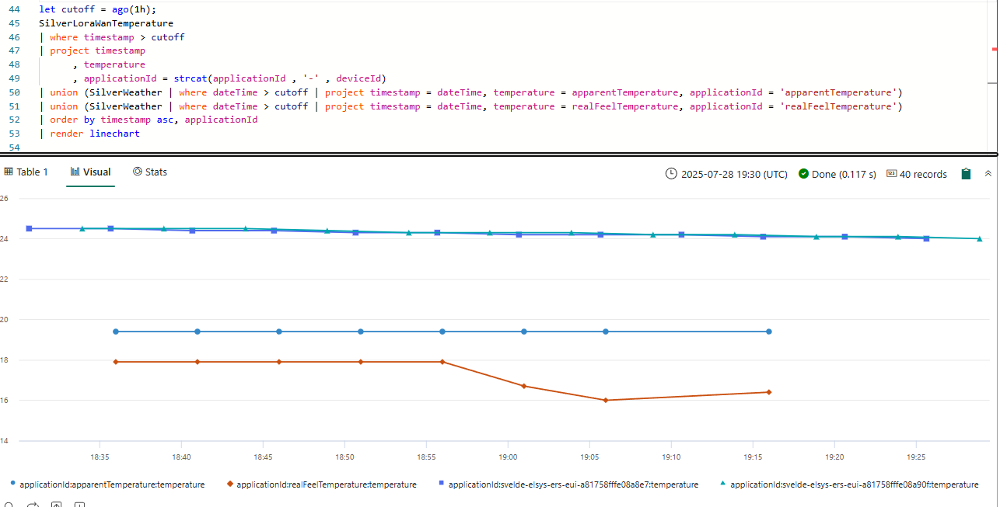

3. Regarding the sensor values, we render every single value here. This looks nice here, but in a chart, this means a lot of detailed information will be rendered when you are looking at weeks of data. These details are not needed for the report, so let's add a `GoldLoraWanTemperature` materialized view having telemetry averages. **Execute this KQL command** to create the materialized view.

```
.create materialized-view with(lookback=10m, lookback_column = "timestamp", backfill=true, docString="LoraWan environmental data entries per ten minutes", folder="MaterializedViews") GoldLoraWanTemperature on table SilverLoraWanTemperature
{
SilverLoraWanTemperature
| summarize temperature = avg(temperature), humidity = avg(humidity), light = avg(light), battery = avg(battery) by bin(timestamp, 10m), applicationId, deviceId
}
```

4. The `GoldLoraWanTemperature` materialized view is created, offering average values based on the LoraWan temperature sensor data every ten minutes (notice that the timestamp increment).

   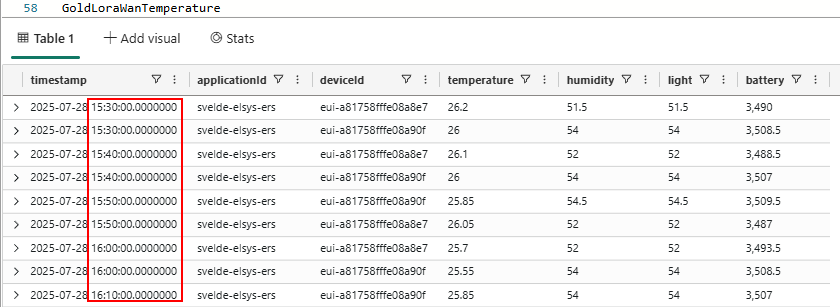

5. Let's combine both gold queries so we have an overview of both LoraWan environmental sensor data and real-time weather data that offers both performance and enough details to add value. **Check out this query**.

```
let cutoff = ago(1h);
GoldLoraWanTemperature
| where timestamp > cutoff
| project timestamp
      , temperature 
      , applicationId = strcat(applicationId , '-' , deviceId)
| union (SilverWeather | where dateTime > cutoff | project timestamp = dateTime, temperature = apparentTemperature, applicationId = 'apparentTemperature')
| union (SilverWeather | where dateTime > cutoff | project timestamp = dateTime, temperature = realFeelTemperature, applicationId = 'realFeelTemperature')
| order by timestamp asc, applicationId
| render linechart
```

6. The following chart is rendered. Notice the LoraWan sensor values are now rendered as averages at a ten minutes interval. 

   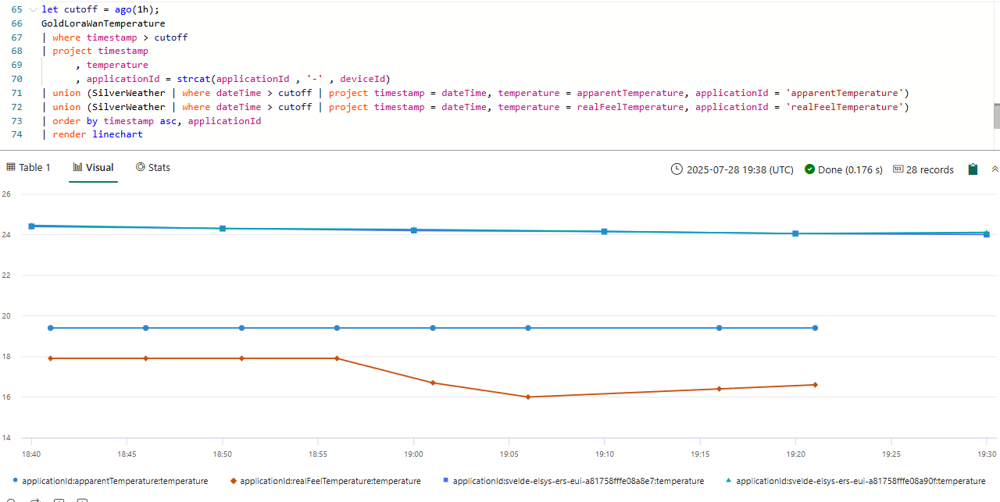

7. Because this is an interesting query to share with others within your team, having access to the same Microsoft Fabric workspace, let's turn this into a Real-Time Dashboard. **Put the cursor in the last query** so it is selected. **Click 'Pin to dashboard'**.

   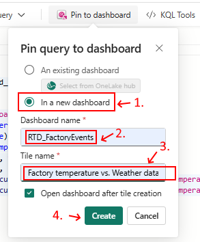

8. A dialog is shown. First, select pinning to a new dashboard by selecting `In a new dashboard`. Then, **Name** the new dashboard `FactoryEvents_RTD` and **name** the tile within the dashboard, showing this query `Factory temperature vs. Weather data`. Finally, **Create** the dashboard.

   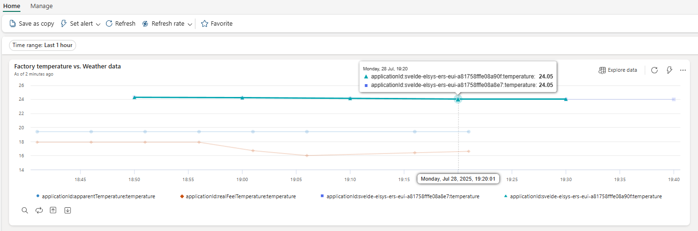

9. A Real-Time dashboard is shown. Notice that we are in 'Viewing' mode. A `Time range` of the last hour is shown, just above the tile we added. This is a 'parameter' (actually two: start time and end time) that can be applied to tiles like a filter. But if we change this `Time range` dropdown, nothing happens. The query is not noticing the `Time range` parameter change yet. Let's fix this. First, we turn the 'Viewing' mode into **Editing** mode.

   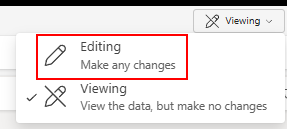

10. The tile supports two ways to edit it. **Edit** the tile.

   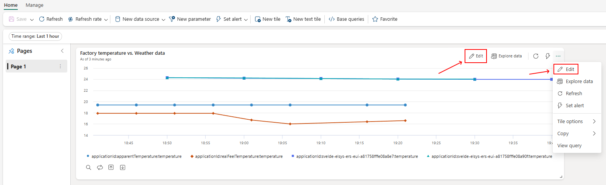

11. The original query is shown with the 'hard-coded' one-hour cutoff. **Replace the original query** with the following version. Notice that we now use the `_startTime and _endTime` parameters. These parameters are available by default, but we can add additional parameters based on queries or hard-coded values (out of scope in this workshop). Notice that the `render` part of the query is also removed.

```
GoldLoraWanTemperature
| where timestamp between (['_startTime'] .. ['_endTime']) // Time range filtering
| project timestamp
      , temperature 
      , applicationId = strcat(applicationId , '-' , deviceId)
| union (SilverWeather | where dateTime between (['_startTime'] .. ['_endTime']) | project timestamp = dateTime, temperature = apparentTemperature, applicationId = 'apparentTemperature')
| union (SilverWeather | where dateTime between (['_startTime'] .. ['_endTime']) | project timestamp = dateTime, temperature = realFeelTemperature, applicationId = 'realFeelTemperature')
| order by timestamp asc, applicationId
```

12. If you **run** the updated query and **change the Time range** to eg. 30 minutes, you see the time span of the line chart is updated automatically. Press **Apply changes** for the tile. **Save** the Dashboard changes. Notice that other parameters, like a filter of the available devices, could be added (out of scope in this workshop). Before we change the mode back to 'Viewing', we alter the Auto refresh. **Select** the `Manage tab`.

   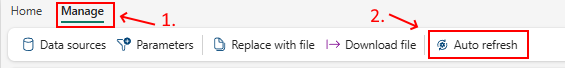

13. **Open** the `Auto refresh` dialog. You need to **enable Auto refresh** and **set the default refresh rate** to `continuous`.

   

14. **Apply** the Auto refresh settings. You return to the Dashboard, still in 'Editing' mode. **Save** the changes again. **Change** the 'mode' back to `Viewing`. The tile is now showing the temperatures again. Let's check the interaction with the parameter. **Change it into 'last 30 minutes'**.

   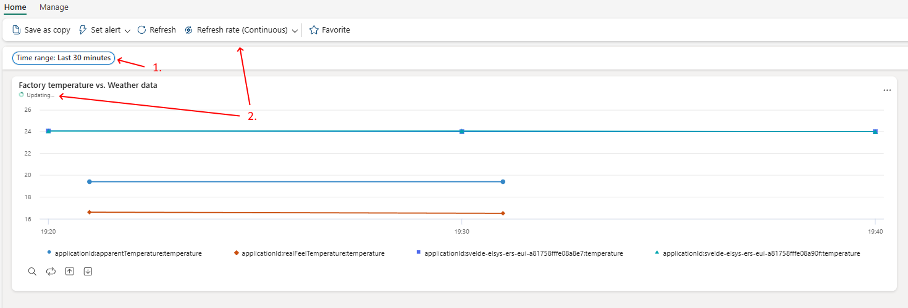

15. Notice the Time range parameter dropdown is working now, fewer values are shown. We also notice that the Real-Time dashboard is now updated in real-time. **Click** the `Share` button.

   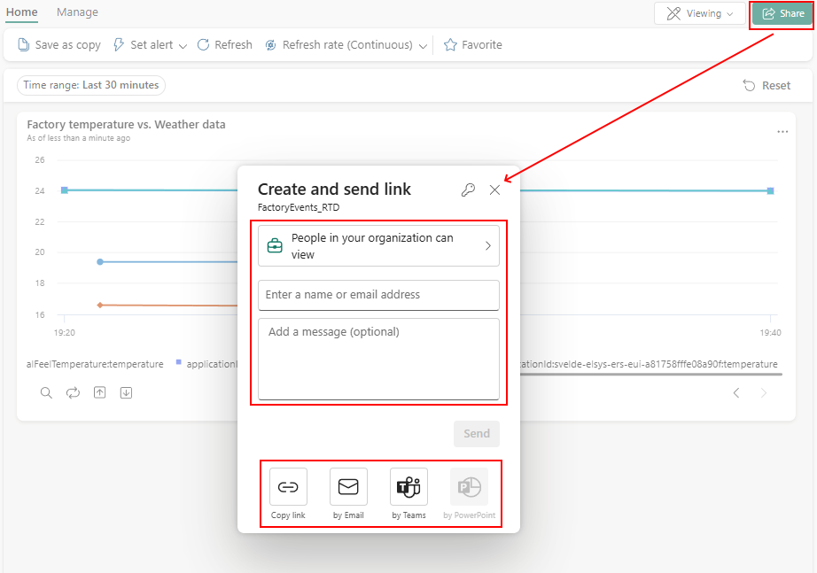

16. A pop-up dialog is shown, offering several ways to share this dashboard with other People in your organization. You can eg. copy a link and share it with them or share the link via email or Teams (out of scope for this workshop). Once you are ready with checking out this dialog, **cancel** it by clicking the cross in the upper right corner. 

Queries we want to share with others are the ones we share in Real-Time Dashboards. We can make the tiles more interactive with the standard time span parameters or with custom parameters (based on queries or just hard-coded values). 

We can also adjust the default refresh rate, ideal for a dashboard that needs less interaction, eg. on a display in a 'war room' of a factory.

Finally, we can share these dashboards in several ways and limit the access (eg. view, edit, and reshare).

Now, let's investigate how more traditional data lakes can benefit from real-time data.

### 4. Lab 03.6 - Adding Lakehouse shortcuts to real-time data via OneLake

A Microsoft Fabric Lakehouse is a unified platform for storing, managing, and analyzing both structured and unstructured data, turing eg. CSV files into tables. Using more traditional SQL, these tables can be queried.

   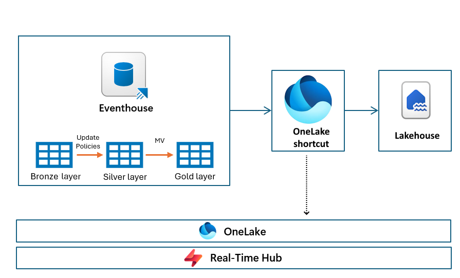

Microsoft Fabric OneLake is the single, unified, logical data lake for Microsoft Fabric, designed to be the central storage for all organizational data. Here, Fabric users can exchange data without the need of copying the data while keeping full control over access.

Here, factory data from several 'silver' tables will be shared via OneLake so a Lakehouse can reference that data as tables too.

1. The timeseries data in the KQL Database is not accessible by default in the Fabric OneLake. **Navigate** to the `FactoryEvents_EH` overview page and see that OneLake availability is disable:

   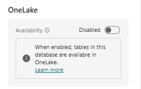

2. Although this option offers Onlake access for all tables, we can also enable it per table. **Enable OneLake availability** for all three 'silver' tables `SilverEnergyMeterCurrent`, `SilverEnergyMeterVoltage`, and `SilverLoraWanTemperature`.

   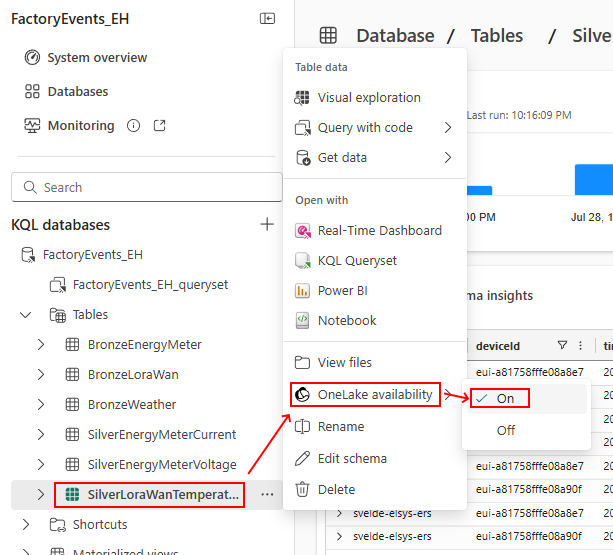

3. Now, the tables are accessible from other Fabric resource, eg. a Lakehouse. To create an Eventhouse, **click** on the button `+ New Item` in the workspace.

   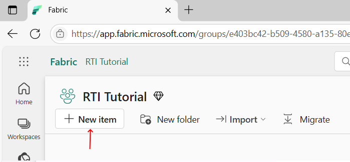

2. In the pop-up window 'New item', filter and select `Lakehouse` while 'All items' is selected. Here we **filter** for items with `lakehouse` in the name. **Select** the Lakehouse.

   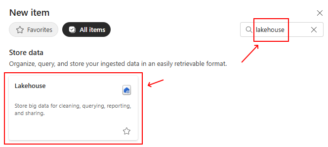

3. In the dialog 'New Lakehouse' **insert** `FactoryEvents_LH` as the name and **click** on `Create`.

   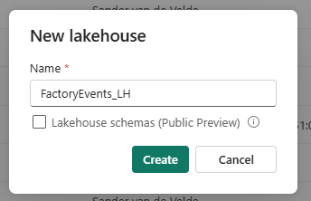

4. After the Lakehouse has been created, it will be automatically opened. To access Eventhouse tables via OneLake, **add a shortcut**.

   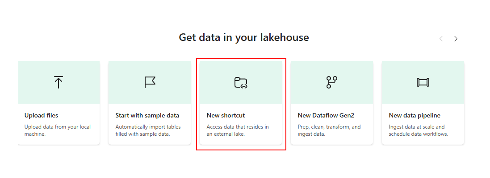

<div class="important" data-title="Note">

> A OneLake shortcut in Microsoft Fabric is a reference that allows you to access data stored in various locations, both within Fabric and external sources, as if it were stored locally within OneLake, without actually moving or copying the data first. These shortcuts act as virtual links, enabling seamless data access and collaboration across different domains, clouds, and account.

</div>

5. A OneLake shortcut wizard is launched.

   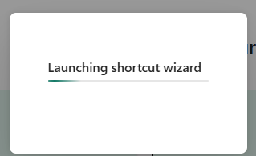

6. In a new dialog, we can see several sources for shortcuts, including OneLake. **Select it**.

   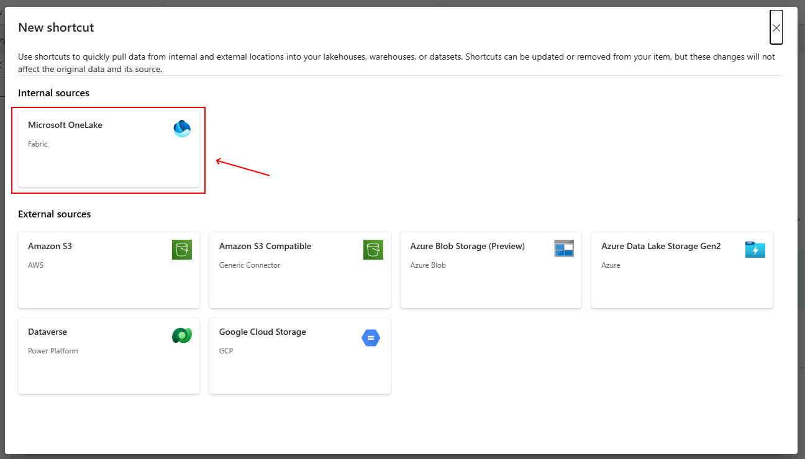

7. We see the KQL Database `FactoryEvents_EH` is listed. **Select** it and **click the Next Button**. 

   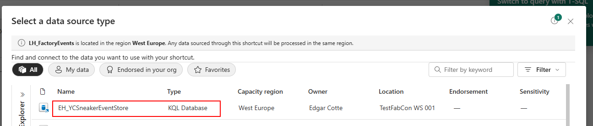

8. Notice that in OneLake, three KQL Database tables are available. Those are the 'silver' tables we made available for OneLake.

   

9. **Select** all three tables via the check boxes and **press Next**.

   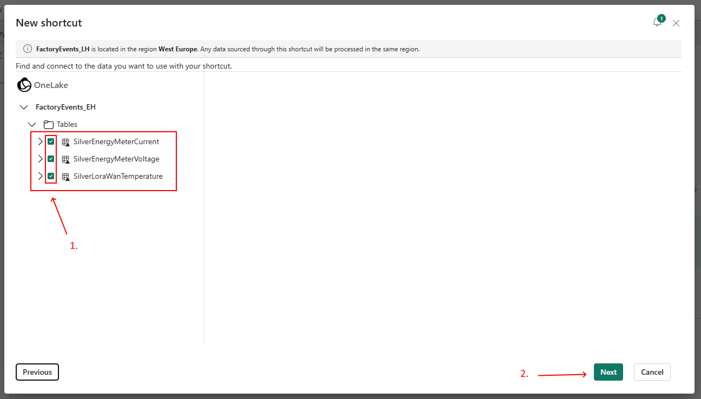

10. All three tables with real-time data will become available in the Lakehouse via OneLake shortcuts. **Create** the shortcuts.

   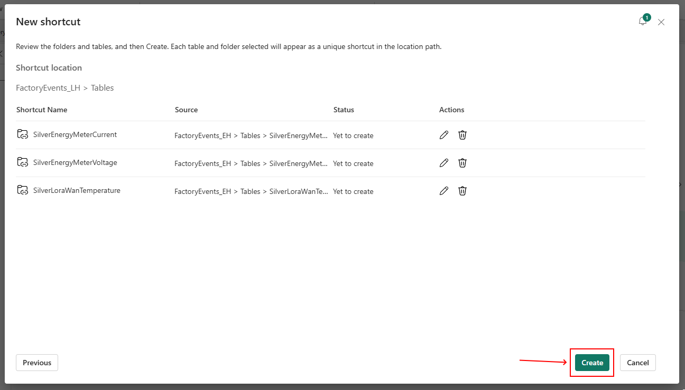

11. The three KQL queries are now available in the Lakehouse.

   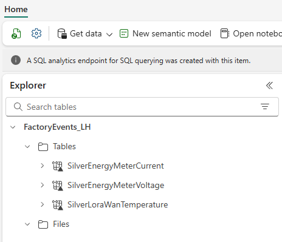

<div class="important" data-title="Note">

> This workshop will not dive deeper into the Lakehouse query endpoint where SQL statements can be used to query the tables inside this Lakehouse (and thus the underlying data sources). Check the Lakehouse documentation for more details. 

</div>

12. We can also add context data about our factory in Lakehouse, like a list of production lines and operators. This 'enterprise' level data tells us under which circumstances the real-time data was created. **Upload files** via the associated button.

   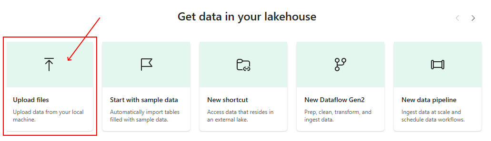

13. You are asked to upload files.

   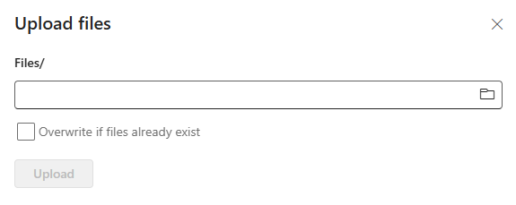

14. Get the 'Operator.csv' and 'ProductionLine.csv' from this [GitHub location](https://github.com/microsoft/fabconrtiworkshop/tree/main/assets). **Download both files** and store them on your laptop as CSV format. Finally, **Click on the Files folder** bar, **select** the files, and **click** on the Upload button. 

   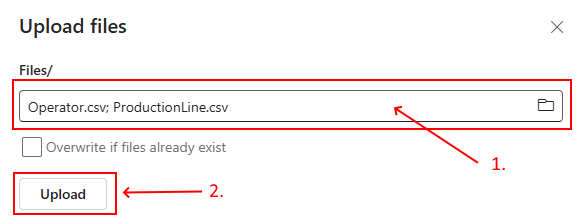

15. The two files are uploaded. You can **close** this dialog.

   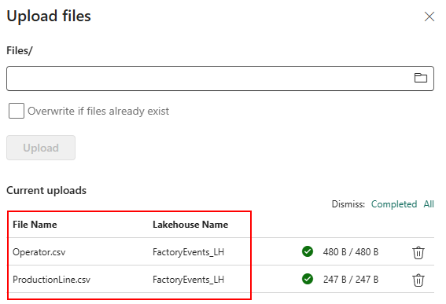

16. The two files are now part of the Lakehouse. **Click** on the Files folder and notice the two files.

   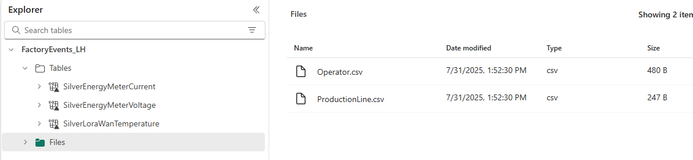

17. Let's turn these two files into tables too so we can work with them. **Hover over** the 'Operator.csv' file and there `...` (three dots) appear. This gives access to a menu, offering the ability to turn this file in a new table. **Create a new table** based on the `Operator` file.

   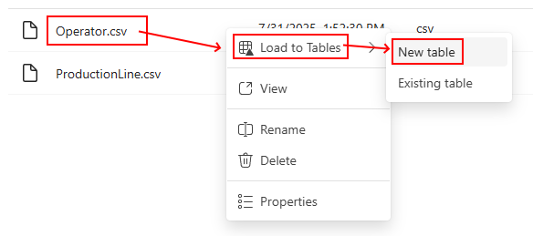

18. Keep all settings and **Load** the `Operator` file into a new `operator` table.

   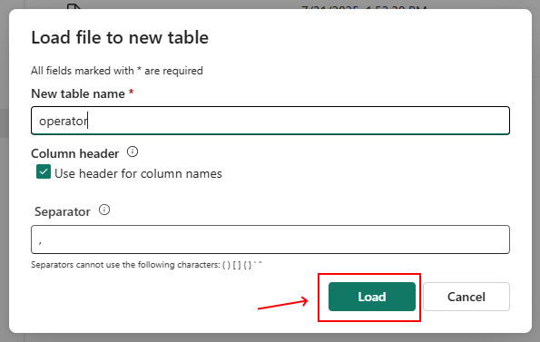

19. **Repeat** the last steps for the 'ProductionLine' file. **Create** an new label based on the `ProductionLine` file. **Load** the `ProductionLine` file into a new `productionline` table. Both tables with context data are added. Here we see the content of the 'ProductionLine' context data, showing that `line1` is operational and is producing 'vulcanized rubber'. Notice that both our electromotor and one of the LoraWan temperature sensors are related to this production line.

   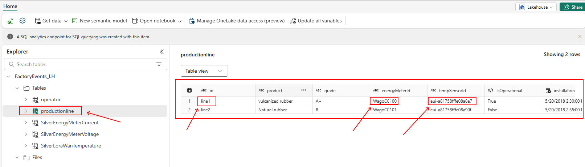

In our Lakehouse, we have gathered both real-time data from sensors and contextual data.

Let's dive into that data via a Digital Twin, available in Microsoft Fabric.

<div class="important" data-title="Note">

> This workshop will not dive deeper into the Lakehouse query endpoint where SQL statements can be used to query the tables inside this Lakehouse (and thus the underlying data sources). Check the Lakehouse documentation for more details. 

</div>

### 4. Lab 03.7 - Adding a Digital Twin Builder

A Digital Twin is a simplified representation, a model, based on real-life 'things' like devices, locations, buildings, vehicles, or even persons.

   

Here, we are building a Digital Twin where our production line is operated by several operators. We also gather realtime data for the production line and make that available in our Digital Twin too.

1. First, to create an Digital Twin, **click** on the button `+ New Item` in the workspace.

   

2. In the pop-up window 'New item', filter and select `Digital Twin Builder` while 'All items' is selected. Here we **filter** for items with `twin` in the name. **Select** the Lakehouse.

   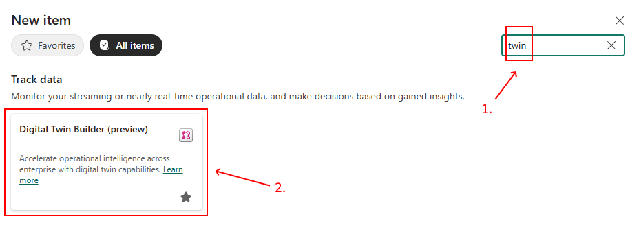

3. In the dialog 'New Digital Twin Builder' **insert** `FactoryEvents_DTB` as the name and **click** on `Create`.

   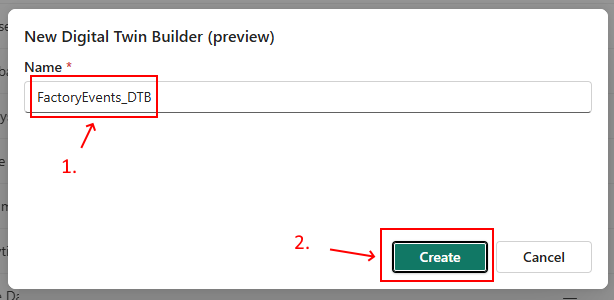

4. Before we can add twins reflecting real-world objects and locations, we first need to add entities and relationships. We derive these 'domain model entities' from the context data we have: Production lines and Operators. **Add** our first entity.

   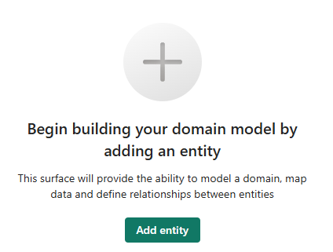

5. **Add** a `generic` entity type named `Productionline`.

   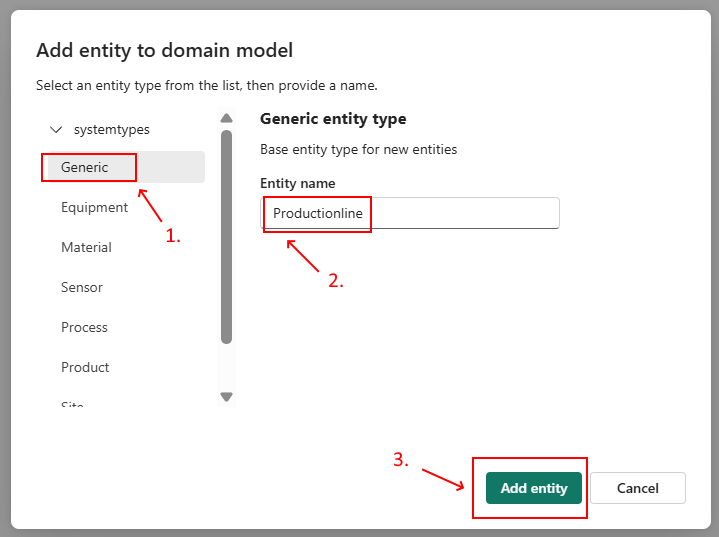

6. The 'Productionline' entity is created and all it has is a DisplayName as property. Let's add more properties by mapping it on context data. **Open** the `Mappings` tab and **click  Add data**.

   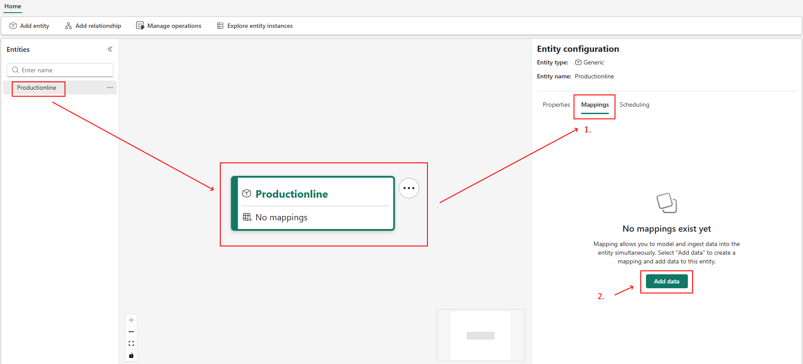

7. A Lakehouse table must be selected, **press** the `Select Lakehouse table` button first. **Select** the `FactoryEvents_LH` in the Workspace and **Select** the `productionline` table.  

   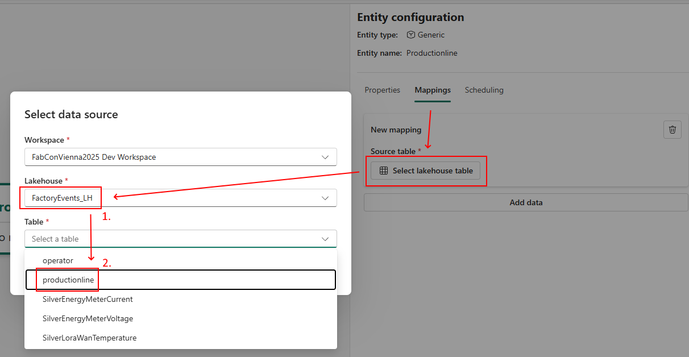

8. Once selected, **choose** this datasource.

   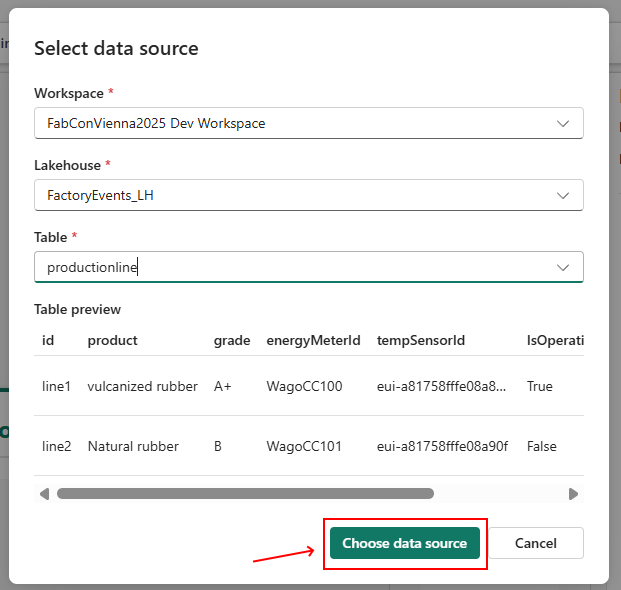

9. So, a non-timeseries datasource is chosen. We still need to provide a unique id and map additional properties. Let's start with the id. **Click** on the `pencil` next to 'Select an Id'.

   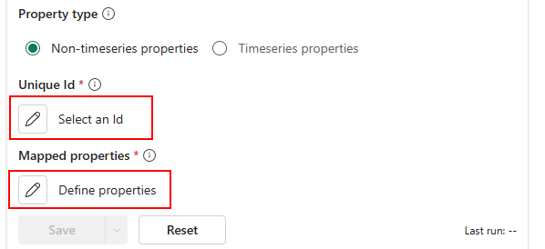

9. In the new dialog **select** the `id` column as unique ID column and **Press** the `OK` button.

   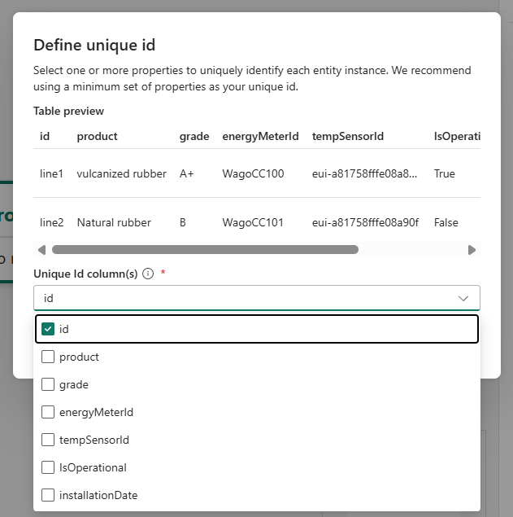

10. The next step is mapping *all* properties which takes a bit more effort. First, **click** on the `pencil` next to 'Select an Id' to open the dialog. As seen above, an entity has a DisplayName property. **Map** it to the same `id` column because it values (eg. 'line1', 'line2') best describe the production lines.

   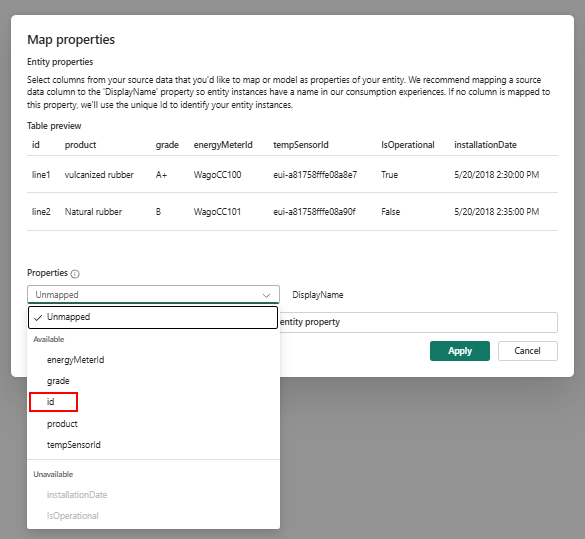

11. After that, **map** *all* table columns to entity properties: `energyMeterId`, `grade`, `id`, `installationDate`, `isOperational`, `product`, and `tempSensorId`. **Keep** the proposed property names. **Click** the `checkbox` to acknowledge we do not want to change anything anymore. **Apply** the settings.

   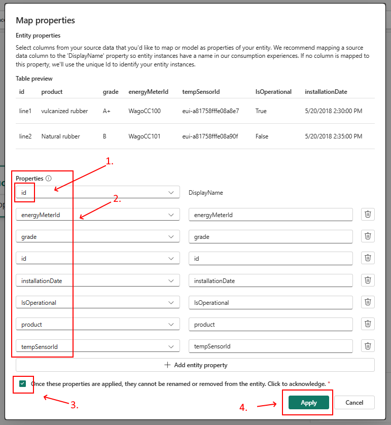

12. **Save** the properties. Now, we have a full 'productionline' entity. The next step in the Digital Twin Builder environment is loading the actual Twins (the rows in the 'productionline' table) by hand or scheduled. These are also called 'Entity instances'. **Click** on the `Scheduling` tab. 

   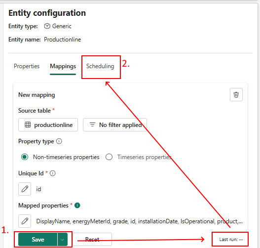

13. Here, we run the ingestion by hand. **Click** on the `Run` button. The ingestion is scheduled via a Digital Twin Builder flow in the background.

   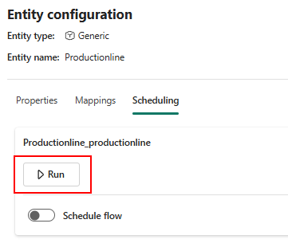

14. Although not worked out, check the `Schedule flow`. **Create** a new flow and **name it** `productionlinescheduler`.

   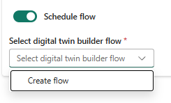

15. A new dialog is shown to manage the scheduler. It should be clear that context date like a list of `production lines` or `operators` does not change often so a daily ingest at 01.00 AM would be perfect. At that moment, the Lakehouse table context is read and the Twins (or 'Entity instances') are updated. You can **Apply** one or **Discard** it for now.

   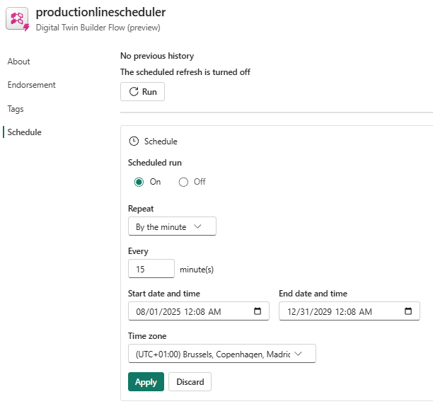

16. **Repeat** the last steps by **adding** a generic  entity with an entity name `Operator` and using the the `FactoryEvents_LH` Lakehouse `operator` table as datasource. The 'Unique Id' is the operator table `Id` column. **Add** *all* columns as properties. The 'DisplayName' is the operator table `Name` column. Finally, **run** the ingestion flow by hand for 'operator' entity instances. (Optionally, you can add a scheduler for this mapping too.) 

   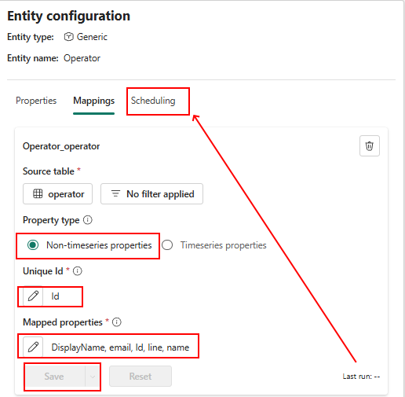

17. Next, add the relationship between the production lines and operators where multiple operators 'operate' on the same line. As seen in the table rows, each operator is related to one production line. **Click** on the `Add relationship` menu button while the `Operator` entity is **selected**.

   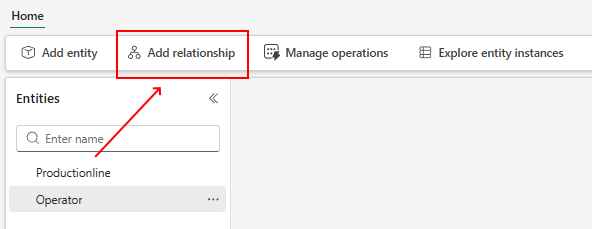

18. **Configure** the Operator `line` column and the Production line `Id` so a `Many operators per production line` relationship is created, having the name `Operates`. **Click** on the `Create` button.

   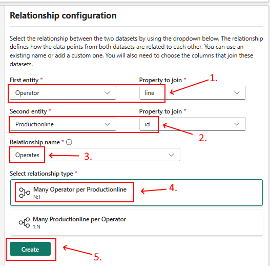

19. This results in this relationship between operator Twins and product line Twins. **Click** on the relation to select it.

   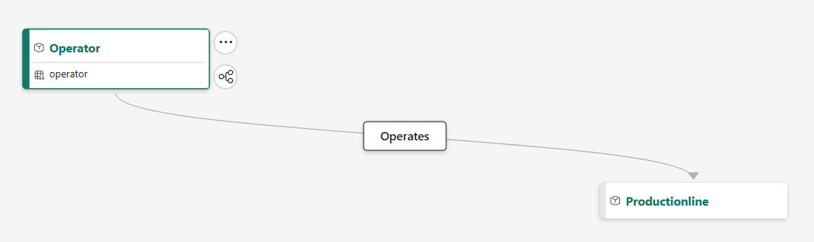

20. Each entity has twins via its own underlying Lakehouse table rows but a relationship must de based on the context of both entities. This is why relationships have their own scheduling. **Run** the update. Optionally, a scheduler can be added too. THe relationship scheduler normally runs *after* the entity tables are updated via their own scheduler.

   

21. We can check the execution of scheduled ingestion. **Click** on the `Manage operations` menu button.

   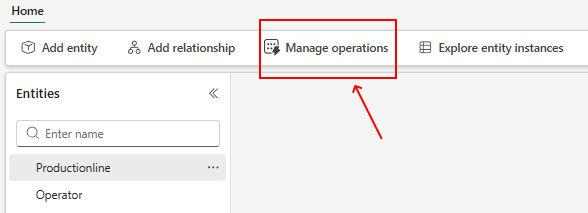

22. This leads to an overview of all Twin and relationship updates via the various flows. Details are available too. **Click** the `home` in the left upper corner to go back to the entities.

   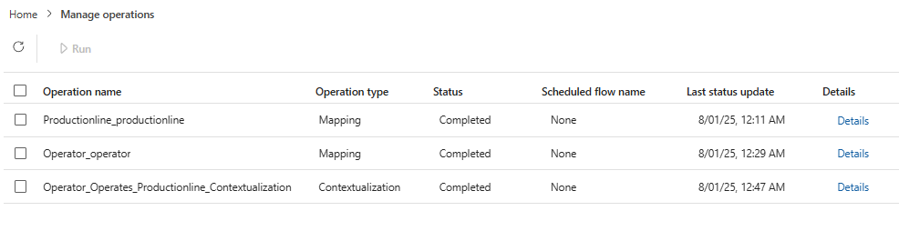

23. Until now, we have experienced how we can shape both entities, relationships, and instantiate actual entity instances (Twins) by ingesting the context data (production lines, operators, etc). By adding more entities and relationships, your *ontology* can grow larger and larger. But, we are still missing one important part and that is mapping 'timeseries data' to entities and updating the timeseries related properties with the underlying timeseries rows. We already have three OneLake shortcut tables being filled with Eventhouse table rows in the 'FactoryEvents_LH' Lakehouse. **Let's map** these three tables and relate them via columns in the production line table (eg. energyMeterId, tempSensorId). **Navigate** to the 'mapping' tab of the 'Productionline entity' and **click** `Add data`. 

   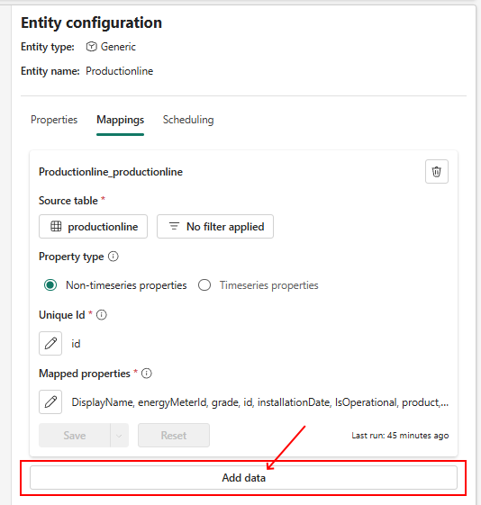

24. In the new dialog, select the data source. As Lakehouse, **select** `FactoryEvents_LH` and as table, **select** `SilverLoraWanTemperature`. **Choose** this data source.

   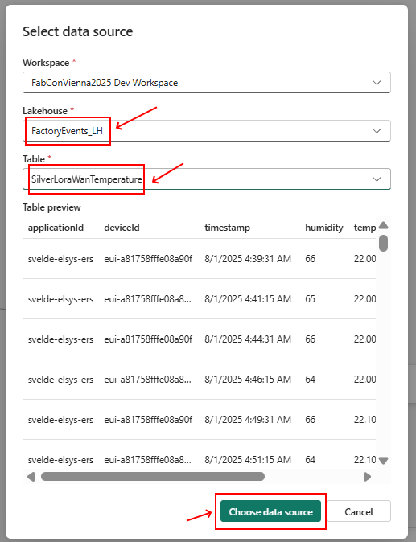

25. In this new 'SilverLoraWanTemperature' mapping Entity configuration, **Select** the `Timeseries properties` as 'property type'. With that we first **add** `mapped properties` in a new dialog. Because timeseries data is all about time-related observations, we need to **select** `timestamp` as `Timestamp` property. After that, **add** the other `applicationId`, `battery`, `deviceId`, `humidity`, `light`, and `temperature` entity properties. **Click** the `checkbox` to acknowledge the changes and **apply** the changes. The Mapped properties are set.

   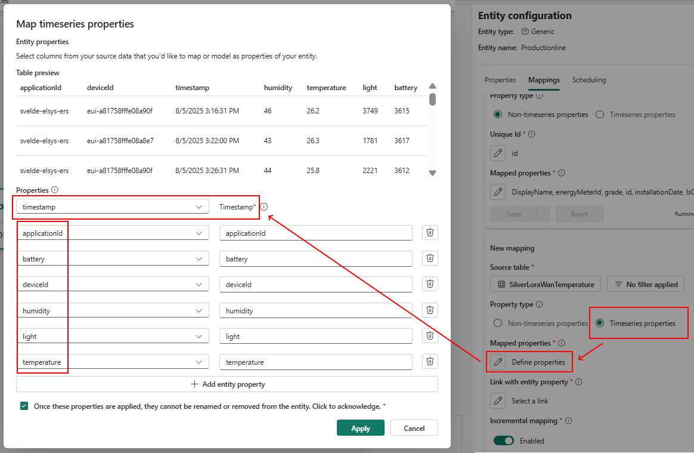

26. Next, the 'Lorawan Temperature sensor' time-series data must be related to the `Production line` entity. For that, we **link** with an `entity property` 'tempSensorId' in a new dialog. In that dialog, select the 'Production line' entity `tempSensorId` at the top and link it by **selecting** the `deviceId` in the 'LoraWan Temperature' timeseries data. **Apply** the link.

   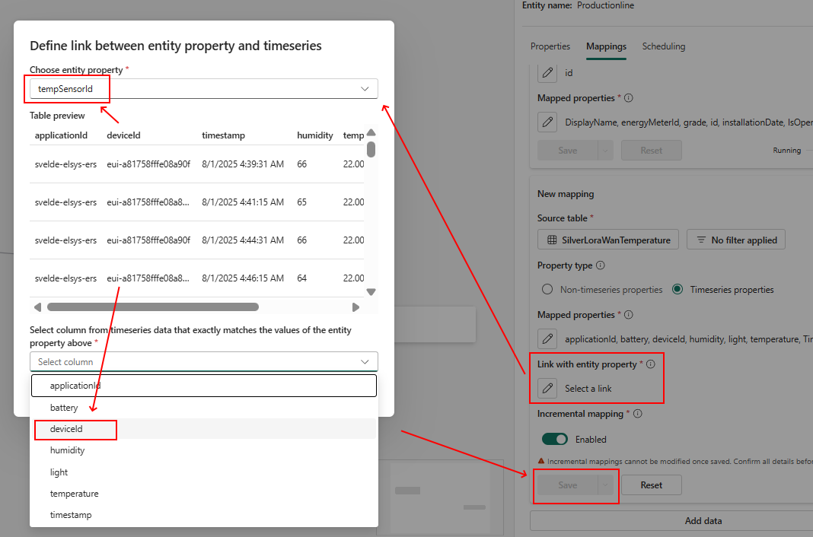

27. Finally, we need to setup a schedule for this LoraWan temperature timeseries data. **Select** the `scheduling` tab and **run** the flow to ingest the 'Productionline_SilverLoraWanTemperature_TimeSeries'. Notice that the on-demand digital twin builder flow has been successfully queued. In a real-life scenario, this flow should be scheduled eg. every 15 minutes to update the Digital Twin with the latest timeseries rows of related 'LoraWan Temperature devices'.

   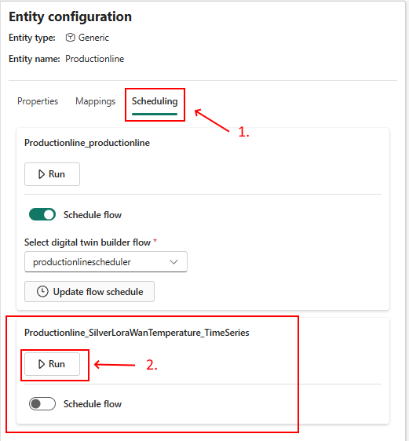

28. We repeat the same 'Add LoraWan Temperature timeseries data' steps for the 'SilverEnergyMeterCurrent' shortcut table. First, **Add** the `SilverEnergyMeterCurrent` data source and **set** the 'property type' to `timeseries properties`. When mapping the properties, not all columns from the previous timeseries datasource mapping can be mapped here (like 'temperature'). Just ignore them if no mapping is applicable. When mapping is applicable, **map** the `deviceId` and `timestamp`. And, **add** new mappings for `building`, `city`, `company`, `country`, `currentValue`, `line`, and `unit`.

   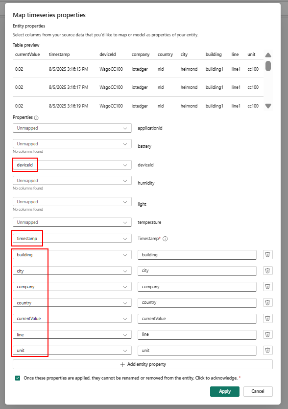

29. **Link** the 'productionline' entity property `energyMeterId` to this timeseries data column `deviceId` in this realtime table.

   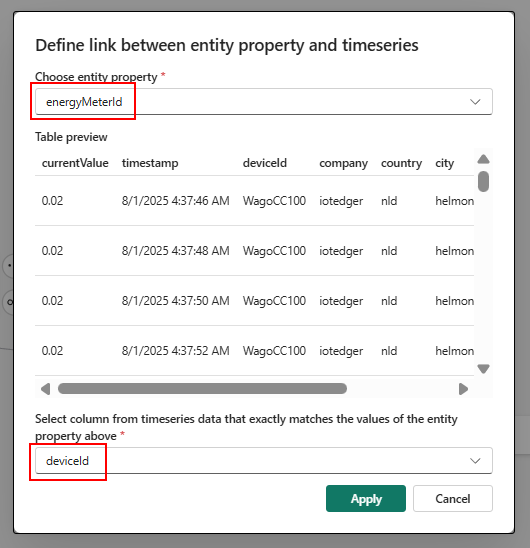

30. Finally, we repeat the same 'SilverEnergyMeterCurrent' steps for the 'SilverEnergyMeterVoltage' shortcut table. First, **Add** the `SilverEnergyMeterVoltage` data source and **set** the 'property type' to `timeseries properties`. Again, when mapping the properties, not all columns from the previous  *two* timeseries datasource mappings can be mapped here. So, **Map** the `building` and `city`, `company`, `country`, `deviceId`, `line`, `timestamp`, and `unit`. **Add** the new mapping `currentValue`.

   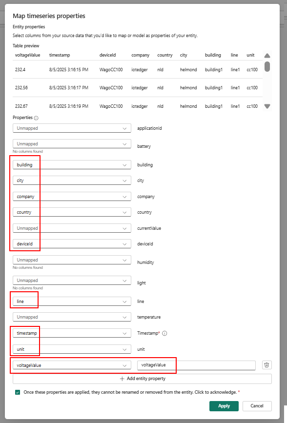

31. **Link** the 'productionline' entity property `energyMeterId` to this timeseries data column `deviceId` in this realtime table.

   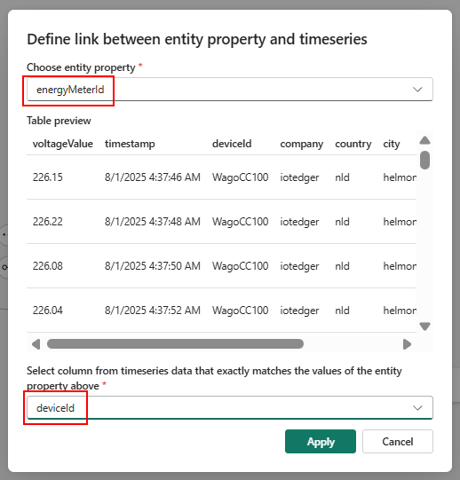

32. We now have mapped all three Lakehouse tabled with real-time timeseries data to the 'production line'. **Run** the `schedule` for the second and third timeseries mapping too.

   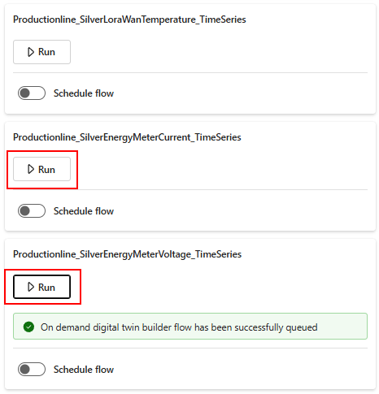

33. **Wait** until the status of all ingestion pipelines is set to `completed`. Each pipeline should have run at least once succesfully so data and relations are in place. 

   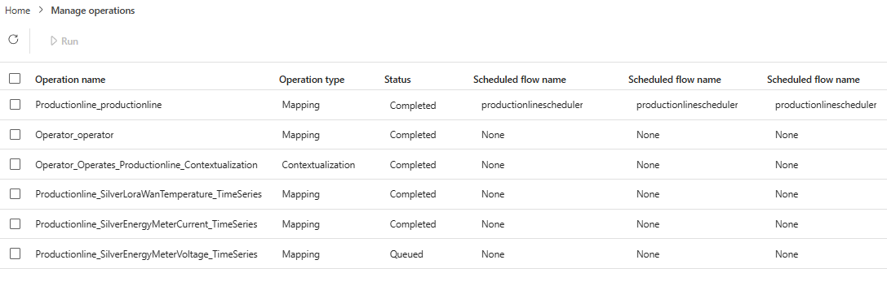

34. We have now set up both the Digital Twin 'ontology' and have the twins and relationships up and running. Until now, we have only payed with the graph, not the twins themselves. In the menu bar, **click** `Explore entity instance`, or: Twins.

   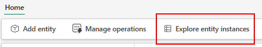

35. In a new dialog, we see both the ingested Production lines and Operators. We can use a simple filter to get to some entity like 'line1'. There is also an `Advanced query` option.

   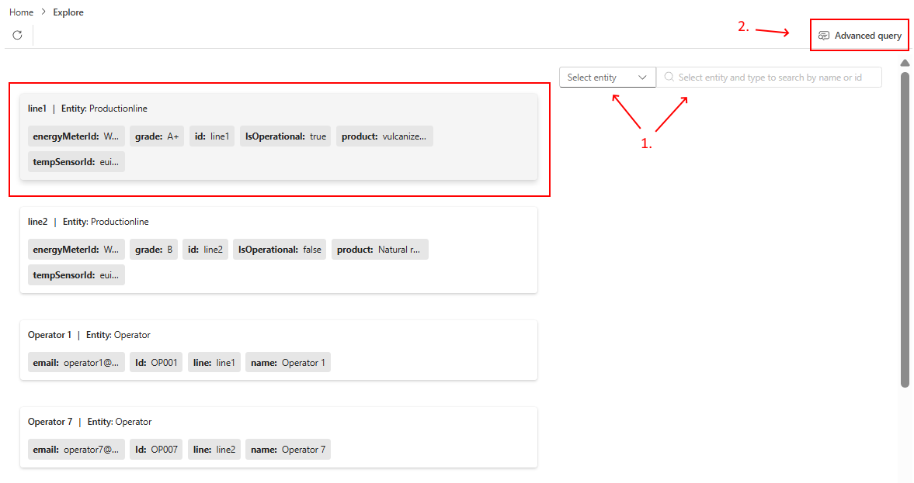

36. Although we will not dive deeper in this Advanced query, we see we can filter on entities with certain property values.

   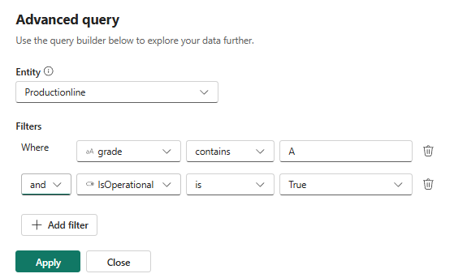

37. **Select** Production line `line1`. In the 'Details' the current properties of this production line are shown.

   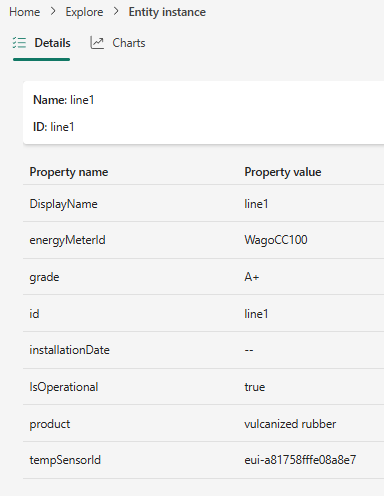

38. **Click** the `Charts` tab and **select** the `light` and `battery`, and `voltage` checkboxes. Notice that the latest data is shown and the realtime data from all three shortcut table are mixed (here we see that the light sensor of this production line tells us the factory got dark during the night, so probably no artificial light were lit during the night).

   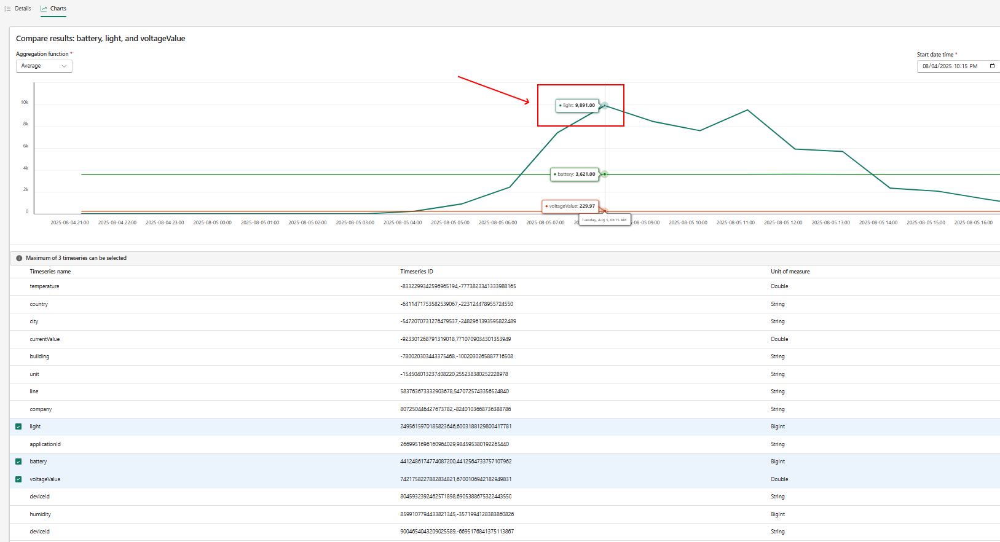

This concludes our Digital Twin Builder experience. Notice that this Fabric item is still in preview. Still, we are already able to capture multiple data sources, both real-time data and contextual data, and related them into this 'ontology' model. This was all done without a single line of code. So users can get a good understanding of what the situation of each Twin is and how real-time data from multiple sources works together.